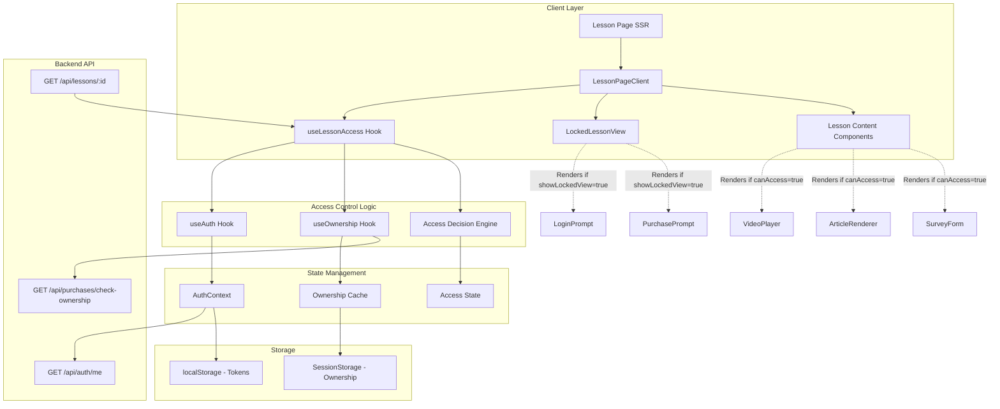
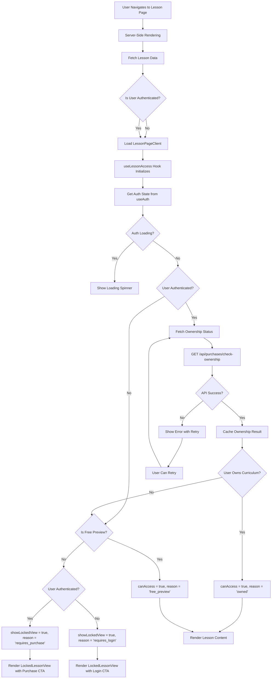
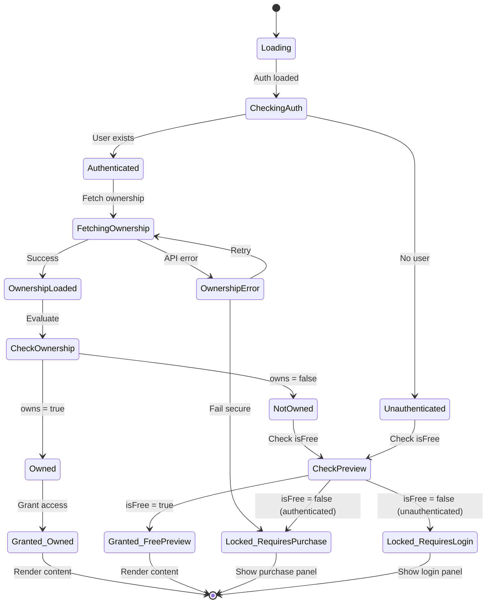
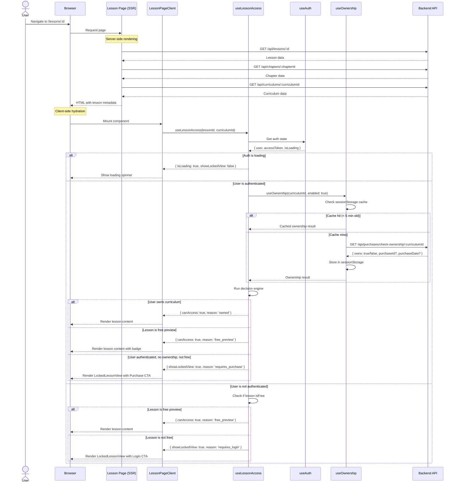
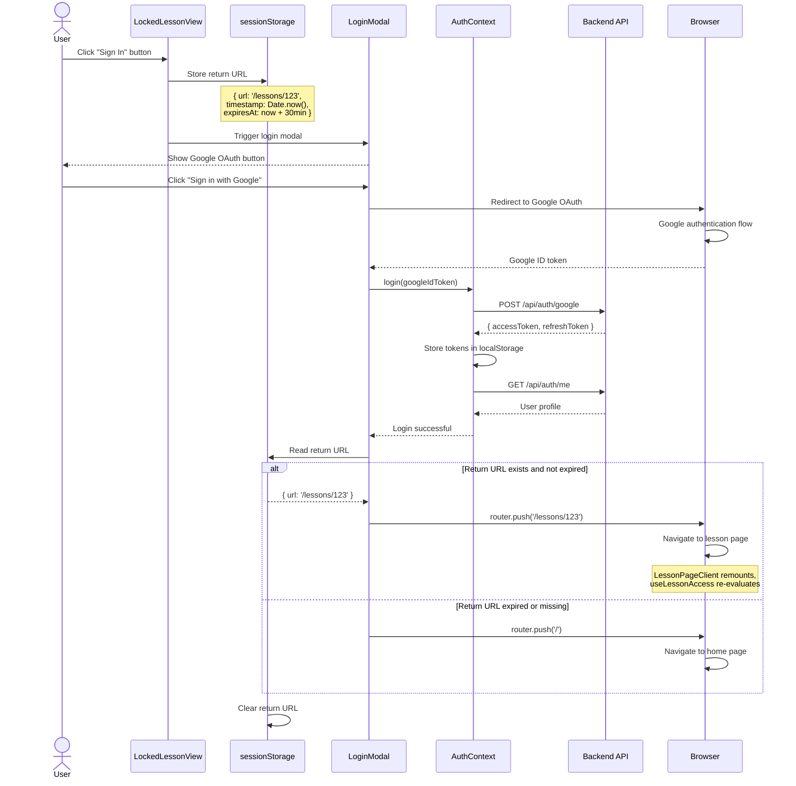
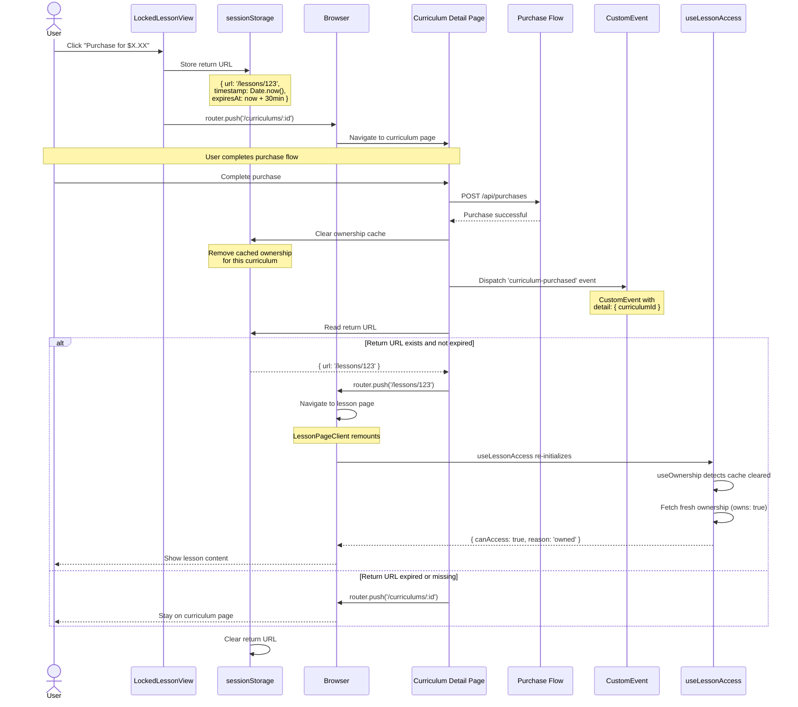
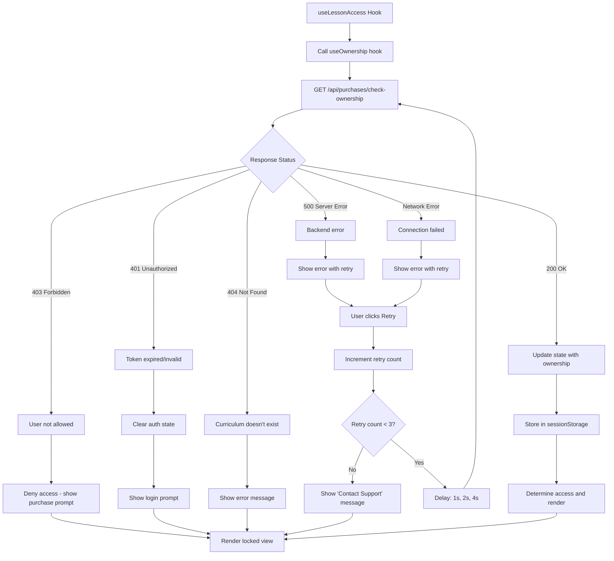

# Design Document: Lesson Access Control

## Document Information
- **Feature**: Lesson Access Control System
- **Phase**: Phase 2 - Access Control & Payment
- **Status**: Design Phase
- **Created**: 2025-11-28
- **Language**: TypeScript/TSX (React with Next.js 14)
- **Dependencies**: Phase 1 (Authentication, Lesson Viewer), Purchase System (Phase 2)

## Overview

### Design Goal
Implement a comprehensive access control system that restricts lesson content access based on user authentication status and course ownership. The system will display appropriate blocking panels and guide users through login or purchase flows while maintaining a seamless user experience.

### Scope
This design covers:
- Frontend access control logic and UI components
- Custom React hooks for ownership and access validation
- Integration with existing lesson viewer components
- State management for access control
- Post-login/post-purchase redirect flows
- Backend API integration for ownership validation

### Key Design Principles
1. **Security First**: Always fail secure - deny access when uncertain
2. **Backend Authority**: Backend is the source of truth for access decisions
3. **Progressive Enhancement**: Support JavaScript-disabled scenarios via SSR
4. **User Experience**: Clear visual feedback and actionable CTAs
5. **Performance**: Minimize API calls through intelligent caching
6. **Maintainability**: Centralized access logic via reusable hooks

## Architecture Design

### System Architecture Diagram



### Data Flow Diagram



## Component Design

### Component Hierarchy

```
LessonPage (Server Component)
├── LessonPageClient (Client Component)
    ├── LessonSidebar
    │   └── [Uses ownership for lock icons]
    └── Main Content Area
        ├── Lesson Header (Always visible)
        ├── Access Control Logic (useLessonAccess)
        │   ├── Loading State → Spinner
        │   ├── Error State → Error Panel with Retry
        │   └── Success State → Content or Locked View
        └── Conditional Rendering
            ├── IF canAccess → Lesson Content (VideoPlayer/ArticleRenderer/SurveyForm)
            └── IF showLockedView → LockedLessonView
                ├── LoginPromptPanel (if requires_login)
                └── PurchasePromptPanel (if requires_purchase)
```

### Component: LockedLessonView (Enhanced)

**Current Implementation**: Already exists, requires minor enhancements

**Responsibilities**:
- Display blocking panel with lock icon
- Show appropriate messaging based on access reason
- Provide CTAs (Login or Purchase)
- Handle navigation to login or purchase flow

**Props Interface**:
```typescript
interface LockedLessonViewProps {
  curriculumId: number
  curriculumTitle: string
  curriculumPrice?: number
  isAuthenticated: boolean
  reason: AccessReason  // 'requires_login' | 'requires_purchase'
  onSignIn?: () => void  // Optional custom handler
  onPurchase?: (curriculumId: number) => void  // Optional custom handler
}
```

**Enhancements Needed**:
1. Store return URL in sessionStorage before navigation
2. Add keyboard navigation support (ESC to close/navigate back)
3. Add ARIA labels for accessibility
4. Add preview lesson suggestion link

**Implementation Notes**:
- Already implemented in `/frontend/src/components/LockedLessonView.tsx`
- Minor updates needed for return URL handling
- Visual design already matches requirements

### Component: useLessonAccess Hook (Enhanced)

**Current Implementation**: Partially implemented, needs ownership integration

**Responsibilities**:
- Fetch lesson data to check `isFree` flag
- Fetch user ownership status from backend
- Determine access permissions using decision engine
- Manage loading, error, and retry states
- Cache ownership results for performance

**Hook Interface**:
```typescript
export type AccessReason = 'free_preview' | 'owned' | 'requires_purchase' | 'requires_login'

export interface LessonAccessResult {
  canAccess: boolean
  reason: AccessReason
  freeToPreview: boolean
  showLockedView: boolean
  isLoading: boolean
  error: Error | null
  curriculumId: number
  retry: () => void
}

export function useLessonAccess(
  lessonId: number,
  curriculumId: number
): LessonAccessResult
```

**Decision Engine Logic**:
```typescript
// Priority order (top to bottom):
1. IF loading OR auth loading → Return loading state
2. IF error occurred → Return locked state with error
3. IF user owns curriculum (from useOwnership) → Grant access (reason: 'owned')
4. IF lesson is free preview (isFree = true) → Grant access (reason: 'free_preview')
5. IF user is authenticated → Deny access (reason: 'requires_purchase')
6. IF user is not authenticated → Deny access (reason: 'requires_login')
```

**Enhancements Needed**:
1. Replace `userHasPurchased` prop with `useOwnership` hook call
2. Add session-based caching for ownership results
3. Implement retry logic with exponential backoff
4. Add proper error categorization (network vs authorization)

### Component: useOwnership Hook (New)

**Purpose**: Centralized hook for checking curriculum ownership

**Responsibilities**:
- Fetch ownership status from backend API
- Cache results in sessionStorage for performance
- Invalidate cache on purchase events
- Provide retry mechanism
- Handle authentication state changes

**Hook Interface**:
```typescript
export interface OwnershipResult {
  owns: boolean
  purchaseId: number | null
  purchaseDate: string | null
  isLoading: boolean
  error: Error | null
  retry: () => void
}

export function useOwnership(
  curriculumId: number,
  enabled?: boolean  // Disable hook when user not authenticated
): OwnershipResult
```

**Implementation Details**:
```typescript
'use client'

import { useEffect, useState } from 'react'
import { useAuth } from '@/lib/auth-context'
import { purchasesApi } from '@/lib/api/purchases'

const OWNERSHIP_CACHE_KEY = 'ownership_cache'
const CACHE_DURATION_MS = 5 * 60 * 1000 // 5 minutes

interface OwnershipCache {
  [curriculumId: string]: {
    owns: boolean
    purchaseId: number | null
    purchaseDate: string | null
    timestamp: number
  }
}

export function useOwnership(
  curriculumId: number,
  enabled: boolean = true
): OwnershipResult {
  const { user, accessToken } = useAuth()
  const [owns, setOwns] = useState(false)
  const [purchaseId, setPurchaseId] = useState<number | null>(null)
  const [purchaseDate, setPurchaseDate] = useState<string | null>(null)
  const [isLoading, setIsLoading] = useState(true)
  const [error, setError] = useState<Error | null>(null)
  const [retryCount, setRetryCount] = useState(0)

  // Check cache first
  const getCachedOwnership = (): OwnershipCache[string] | null => {
    if (typeof window === 'undefined') return null

    const cached = sessionStorage.getItem(OWNERSHIP_CACHE_KEY)
    if (!cached) return null

    const cache: OwnershipCache = JSON.parse(cached)
    const entry = cache[curriculumId]

    if (!entry) return null

    // Check if cache is still valid
    if (Date.now() - entry.timestamp > CACHE_DURATION_MS) {
      return null
    }

    return entry
  }

  const setCachedOwnership = (data: Omit<OwnershipCache[string], 'timestamp'>) => {
    if (typeof window === 'undefined') return

    const cached = sessionStorage.getItem(OWNERSHIP_CACHE_KEY)
    const cache: OwnershipCache = cached ? JSON.parse(cached) : {}

    cache[curriculumId] = {
      ...data,
      timestamp: Date.now()
    }

    sessionStorage.setItem(OWNERSHIP_CACHE_KEY, JSON.stringify(cache))
  }

  const fetchOwnership = async () => {
    // Skip if not enabled or user not authenticated
    if (!enabled || !user || !accessToken) {
      setOwns(false)
      setPurchaseId(null)
      setPurchaseDate(null)
      setIsLoading(false)
      return
    }

    // Check cache first
    const cached = getCachedOwnership()
    if (cached) {
      setOwns(cached.owns)
      setPurchaseId(cached.purchaseId)
      setPurchaseDate(cached.purchaseDate)
      setIsLoading(false)
      return
    }

    try {
      setIsLoading(true)
      setError(null)

      const response = await purchasesApi.checkOwnership(curriculumId, accessToken)

      const ownershipData = {
        owns: response.owns,
        purchaseId: response.purchaseId || null,
        purchaseDate: response.purchaseDate || null
      }

      setOwns(ownershipData.owns)
      setPurchaseId(ownershipData.purchaseId)
      setPurchaseDate(ownershipData.purchaseDate)

      // Cache the result
      setCachedOwnership(ownershipData)

      setIsLoading(false)
    } catch (err) {
      console.error('[useOwnership] Error fetching ownership:', err)
      setError(err instanceof Error ? err : new Error('Failed to check ownership'))
      setIsLoading(false)
      // Fail secure - default to not owned
      setOwns(false)
    }
  }

  useEffect(() => {
    fetchOwnership()
    // eslint-disable-next-line react-hooks/exhaustive-deps
  }, [curriculumId, user, accessToken, enabled, retryCount])

  const retry = () => {
    setRetryCount(prev => prev + 1)
  }

  // Invalidate cache on purchase event
  useEffect(() => {
    const handlePurchase = (event: CustomEvent) => {
      if (event.detail.curriculumId === curriculumId) {
        // Clear cache and refetch
        sessionStorage.removeItem(OWNERSHIP_CACHE_KEY)
        fetchOwnership()
      }
    }

    window.addEventListener('curriculum-purchased', handlePurchase as EventListener)
    return () => {
      window.removeEventListener('curriculum-purchased', handlePurchase as EventListener)
    }
  }, [curriculumId])

  return {
    owns,
    purchaseId,
    purchaseDate,
    isLoading,
    error,
    retry
  }
}
```

**Cache Invalidation Strategy**:
- Invalidate on purchase completion (via custom event)
- Invalidate on user logout
- Auto-expire after 5 minutes
- Manual invalidation via retry button

## Data Model

### Core Data Structures

```typescript
// Access Control State
interface AccessControlState {
  canAccess: boolean
  reason: AccessReason
  freeToPreview: boolean
  showLockedView: boolean
  isLoading: boolean
  error: Error | null
}

// Ownership Data (from API)
interface OwnershipResponse {
  owns: boolean
  purchaseId?: number
  purchaseDate?: string
}

// Lesson Access Metadata
interface LessonAccessMetadata {
  lessonId: number
  curriculumId: number
  isFree: boolean  // From lesson.isFree or lesson.contentMetadata.isFreePreview
}

// Return URL Storage (sessionStorage)
interface ReturnURLData {
  url: string
  timestamp: number
  expiresAt: number  // Auto-expire after 30 minutes
}

// Ownership Cache (sessionStorage)
interface OwnershipCacheEntry {
  owns: boolean
  purchaseId: number | null
  purchaseDate: string | null
  timestamp: number
}

interface OwnershipCache {
  [curriculumId: string]: OwnershipCacheEntry
}
```

### State Flow Diagram



## Business Process

### Process 1: Initial Page Load and Access Check



### Process 2: User Clicks Login from Locked Lesson



### Process 3: User Clicks Purchase from Locked Lesson



### Process 4: Error Handling and Retry Flow



## API Integration

### Backend API Endpoints (Required)

#### 1. Check Curriculum Ownership

**Endpoint**: `GET /api/purchases/check-ownership/{curriculumId}`

**Purpose**: Verify if authenticated user owns a specific curriculum

**Authentication**: Required (JWT Bearer token)

**Request Headers**:
```http
Authorization: Bearer {accessToken}
```

**Success Response (200 OK)**:
```json
{
  "owns": true,
  "purchaseId": 42,
  "purchaseDate": "2025-11-20T14:30:00Z"
}
```

**Success Response (Not Owned)**:
```json
{
  "owns": false
}
```

**Error Responses**:
- `401 Unauthorized`: Token missing, expired, or invalid
- `404 Not Found`: Curriculum does not exist
- `500 Internal Server Error`: Database error

**Frontend API Client**:
```typescript
// /frontend/src/lib/api/purchases.ts

import { apiClient } from '../api-client'

export interface CheckOwnershipResponse {
  owns: boolean
  purchaseId?: number
  purchaseDate?: string
}

export const purchasesApi = {
  /**
   * Check if authenticated user owns a curriculum
   */
  async checkOwnership(
    curriculumId: number,
    accessToken: string
  ): Promise<CheckOwnershipResponse> {
    const { data } = await apiClient.get<CheckOwnershipResponse>(
      `/purchases/check-ownership/${curriculumId}`,
      {
        headers: {
          Authorization: `Bearer ${accessToken}`,
        },
      }
    )
    return data
  },
}
```

#### 2. Get Lesson Details (Existing)

**Endpoint**: `GET /api/lessons/{id}`

**Purpose**: Fetch lesson metadata including `isFree` flag

**Authentication**: Optional (public for free lessons, required for owned paid lessons)

**Response Enhancement**:
```json
{
  "id": 123,
  "title": "Introduction to React Hooks",
  "chapterId": 5,
  "lessonType": "VIDEO",
  "contentUrl": "https://youtube.com/...",
  "isFree": true,  // ← CRITICAL for access control
  "contentMetadata": {
    "videoProvider": "youtube",
    "videoId": "abc123",
    "duration": 1200
  },
  // ... other fields
}
```

**Note**: Backend must populate `isFree` based on database `is_free_preview` column

### API Client Updates Needed

Create new file: `/frontend/src/lib/api/purchases.ts`

```typescript
import { apiClient } from '../api-client'

export interface CheckOwnershipResponse {
  owns: boolean
  purchaseId?: number
  purchaseDate?: string
}

export interface PurchaseHistoryItem {
  purchaseId: number
  curriculum: {
    id: number
    title: string
    thumbnailUrl?: string
  }
  amountPaid: number
  status: 'PENDING' | 'COMPLETED' | 'CANCELLED'
  purchaseDate: string
}

export interface PurchaseHistoryResponse {
  content: PurchaseHistoryItem[]
  page: number
  size: number
  totalElements: number
  totalPages: number
}

export const purchasesApi = {
  /**
   * Check if authenticated user owns a curriculum
   */
  async checkOwnership(
    curriculumId: number,
    accessToken: string
  ): Promise<CheckOwnershipResponse> {
    const { data } = await apiClient.get<CheckOwnershipResponse>(
      `/purchases/check-ownership/${curriculumId}`,
      {
        headers: {
          Authorization: `Bearer ${accessToken}`,
        },
      }
    )
    return data
  },

  /**
   * Get authenticated user's purchase history
   */
  async getMyPurchases(
    accessToken: string,
    page: number = 0,
    size: number = 10
  ): Promise<PurchaseHistoryResponse> {
    const { data } = await apiClient.get<PurchaseHistoryResponse>(
      '/purchases/my-purchases',
      {
        headers: {
          Authorization: `Bearer ${accessToken}`,
        },
        params: {
          page,
          size,
          sort: 'purchaseDate,desc',
        },
      }
    )
    return data
  },
}
```

## State Management Design

### Authentication State (Existing - No Changes)

**Location**: `/frontend/src/lib/auth-context.tsx`

**State Structure**:
```typescript
interface AuthContextType {
  user: User | null
  accessToken: string | null
  isLoading: boolean
  login: (googleIdToken: string) => Promise<void>
  logout: () => Promise<void>
}
```

**Storage**: localStorage for tokens, React Context for user state

**No changes needed** - already implemented and working

### Ownership State (New - useOwnership Hook)

**Location**: `/frontend/src/hooks/useOwnership.tsx` (new file)

**State Structure**:
```typescript
interface OwnershipResult {
  owns: boolean
  purchaseId: number | null
  purchaseDate: string | null
  isLoading: boolean
  error: Error | null
  retry: () => void
}
```

**Caching Strategy**:
- **Storage**: sessionStorage (cleared on tab close)
- **Key**: `ownership_cache`
- **TTL**: 5 minutes
- **Invalidation**: On purchase event, logout, manual retry

**Cache Data Structure**:
```json
{
  "1": {
    "owns": true,
    "purchaseId": 42,
    "purchaseDate": "2025-11-20T14:30:00Z",
    "timestamp": 1732792200000
  },
  "2": {
    "owns": false,
    "purchaseId": null,
    "purchaseDate": null,
    "timestamp": 1732792250000
  }
}
```

### Access Control State (Existing - useLessonAccess Hook)

**Location**: `/frontend/src/hooks/useLessonAccess.tsx`

**Current State**: Partially implemented, needs ownership integration

**State Structure** (no changes):
```typescript
interface LessonAccessResult {
  canAccess: boolean
  reason: AccessReason
  freeToPreview: boolean
  showLockedView: boolean
  isLoading: boolean
  error: Error | null
  curriculumId: number
  retry: () => void
}
```

**Updates Needed**:
1. Remove `userHasPurchased` prop parameter
2. Add `useOwnership` hook call internally
3. Update decision engine to use ownership result
4. Handle ownership loading and error states

### Return URL State (New)

**Location**: sessionStorage (managed by LockedLessonView and LoginModal)

**Purpose**: Store lesson URL for post-login/post-purchase redirect

**Storage Key**: `return_url_data`

**Data Structure**:
```json
{
  "url": "/lessons/123",
  "timestamp": 1732792200000,
  "expiresAt": 1732794000000  // 30 minutes later
}
```

**Utility Functions**:
```typescript
// /frontend/src/lib/utils/returnUrl.ts

const RETURN_URL_KEY = 'return_url_data'
const EXPIRY_DURATION = 30 * 60 * 1000 // 30 minutes

export interface ReturnURLData {
  url: string
  timestamp: number
  expiresAt: number
}

export const returnUrlUtils = {
  /**
   * Store the current URL as return destination
   */
  store(url: string): void {
    const data: ReturnURLData = {
      url,
      timestamp: Date.now(),
      expiresAt: Date.now() + EXPIRY_DURATION
    }
    sessionStorage.setItem(RETURN_URL_KEY, JSON.stringify(data))
  },

  /**
   * Get the stored return URL if not expired
   */
  get(): string | null {
    const stored = sessionStorage.getItem(RETURN_URL_KEY)
    if (!stored) return null

    const data: ReturnURLData = JSON.parse(stored)

    // Check expiry
    if (Date.now() > data.expiresAt) {
      this.clear()
      return null
    }

    return data.url
  },

  /**
   * Clear the stored return URL
   */
  clear(): void {
    sessionStorage.removeItem(RETURN_URL_KEY)
  },

  /**
   * Validate URL is safe (prevent open redirect)
   */
  isSafeURL(url: string): boolean {
    // Only allow relative URLs starting with /
    if (!url.startsWith('/')) return false

    // Prevent protocol-relative URLs (//evil.com)
    if (url.startsWith('//')) return false

    // Prevent javascript: or data: URLs
    if (url.match(/^(javascript|data):/i)) return false

    return true
  }
}
```

## Error Handling Strategy

### Error Categories

#### 1. Network Errors
- **Cause**: API unreachable, timeout, no internet
- **Handling**: Show retry button, cache last known state
- **User Experience**: "Unable to connect. Please check your connection and retry."

#### 2. Authentication Errors (401)
- **Cause**: Token expired, invalid, or missing
- **Handling**: Clear auth state, prompt re-login
- **User Experience**: "Your session has expired. Please sign in again."

#### 3. Authorization Errors (403)
- **Cause**: User doesn't have permission to check ownership
- **Handling**: Fail secure - deny access
- **User Experience**: Show purchase prompt (assume not owned)

#### 4. Resource Not Found (404)
- **Cause**: Curriculum or lesson doesn't exist
- **Handling**: Show error message, navigate back
- **User Experience**: "This curriculum or lesson could not be found."

#### 5. Server Errors (500, 503)
- **Cause**: Backend crash, database down
- **Handling**: Show retry with exponential backoff
- **User Experience**: "Something went wrong. Please try again in a moment."

### Error Recovery Flow

```typescript
// Error handling in useOwnership hook

const handleError = (err: unknown) => {
  console.error('[useOwnership] Error:', err)

  if (axios.isAxiosError(err)) {
    const status = err.response?.status

    switch (status) {
      case 401:
        // Token expired - clear auth and show login
        authContext.logout()
        setError(new Error('Session expired. Please sign in again.'))
        break

      case 403:
        // Not authorized - fail secure (deny access)
        setOwns(false)
        setError(new Error('Unable to verify ownership'))
        break

      case 404:
        // Curriculum not found
        setError(new Error('Curriculum not found'))
        break

      case 500:
      case 503:
        // Server error - allow retry
        setError(new Error('Server error. Please try again.'))
        break

      default:
        if (err.code === 'ECONNABORTED' || err.code === 'ERR_NETWORK') {
          // Network error
          setError(new Error('Network error. Please check your connection.'))
        } else {
          setError(new Error('An unexpected error occurred'))
        }
    }
  } else {
    setError(err instanceof Error ? err : new Error('Unknown error'))
  }

  // Fail secure - default to not owned
  setOwns(false)
  setIsLoading(false)
}
```

### Retry Strategy

```typescript
// Retry with exponential backoff

const MAX_RETRIES = 3
const BASE_DELAY = 1000 // 1 second

const retryWithBackoff = async (
  fn: () => Promise<void>,
  retryCount: number
): Promise<void> => {
  try {
    await fn()
  } catch (err) {
    if (retryCount >= MAX_RETRIES) {
      throw new Error('Maximum retries exceeded. Please contact support.')
    }

    // Exponential backoff: 1s, 2s, 4s
    const delay = BASE_DELAY * Math.pow(2, retryCount)
    await new Promise(resolve => setTimeout(resolve, delay))

    return retryWithBackoff(fn, retryCount + 1)
  }
}
```

## Testing Strategy

### Unit Tests

#### 1. useOwnership Hook Tests
**Location**: `/frontend/src/hooks/__tests__/useOwnership.test.tsx`

**Test Cases**:
- ✅ Returns loading state initially
- ✅ Fetches ownership when user authenticated
- ✅ Returns cached ownership if cache valid (< 5 min)
- ✅ Refetches ownership if cache expired
- ✅ Returns owns=false when user not authenticated
- ✅ Handles 401 error (clears auth)
- ✅ Handles 403 error (fails secure)
- ✅ Handles 500 error (allows retry)
- ✅ Handles network error (allows retry)
- ✅ Clears cache on purchase event
- ✅ Retry function increments retry count

#### 2. useLessonAccess Hook Tests (Enhanced)
**Location**: `/frontend/src/hooks/__tests__/useLessonAccess.test.tsx`

**Test Cases**:
- ✅ Returns loading while auth loading
- ✅ Returns loading while ownership loading
- ✅ Grants access when user owns curriculum
- ✅ Grants access when lesson is free preview
- ✅ Denies access (requires_purchase) when authenticated but not owned
- ✅ Denies access (requires_login) when not authenticated and not free
- ✅ Handles ownership error (fails secure)
- ✅ Handles lesson fetch error
- ✅ Retry function refetches ownership

#### 3. LockedLessonView Component Tests (Enhanced)
**Location**: `/frontend/src/components/__tests__/LockedLessonView.test.tsx`

**Test Cases**:
- ✅ Shows login CTA when requires_login
- ✅ Shows purchase CTA when requires_purchase
- ✅ Stores return URL when login clicked
- ✅ Stores return URL when purchase clicked
- ✅ Calls onSignIn callback if provided
- ✅ Calls onPurchase callback if provided
- ✅ Displays curriculum title and price
- ✅ Keyboard navigation works (ESC, Tab, Enter)
- ✅ ARIA labels present for screen readers

#### 4. Return URL Utility Tests
**Location**: `/frontend/src/lib/utils/__tests__/returnUrl.test.ts`

**Test Cases**:
- ✅ Stores URL with expiry
- ✅ Retrieves URL if not expired
- ✅ Returns null if expired
- ✅ Clears stored URL
- ✅ Validates safe URLs (relative paths only)
- ✅ Rejects absolute URLs
- ✅ Rejects protocol-relative URLs
- ✅ Rejects javascript: and data: URLs

### Integration Tests

#### 1. Lesson Access Flow (Owned Curriculum)
```typescript
describe('Lesson Access - Owned Curriculum', () => {
  it('should grant access when user owns curriculum', async () => {
    // Mock authenticated user
    mockAuthContext({ user: mockUser, accessToken: 'token123' })

    // Mock ownership API
    mockAPI.get('/purchases/check-ownership/1').reply(200, {
      owns: true,
      purchaseId: 42,
      purchaseDate: '2025-11-20T14:30:00Z'
    })

    // Mock lesson API
    mockAPI.get('/lessons/123').reply(200, {
      id: 123,
      title: 'Test Lesson',
      isFree: false,
      // ...
    })

    render(<LessonPageClient lesson={...} curriculum={...} />)

    // Wait for loading to complete
    await waitFor(() => {
      expect(screen.queryByText('Checking access...')).not.toBeInTheDocument()
    })

    // Verify content is rendered
    expect(screen.getByTestId('video-player')).toBeInTheDocument()
    expect(screen.queryByText('This Lesson is Locked')).not.toBeInTheDocument()
  })
})
```

#### 2. Lesson Access Flow (Free Preview)
```typescript
describe('Lesson Access - Free Preview', () => {
  it('should grant access to free preview lesson without authentication', async () => {
    // Mock unauthenticated user
    mockAuthContext({ user: null, accessToken: null })

    // Mock lesson API
    mockAPI.get('/lessons/123').reply(200, {
      id: 123,
      title: 'Free Intro Lesson',
      isFree: true,
      // ...
    })

    render(<LessonPageClient lesson={...} curriculum={...} />)

    await waitFor(() => {
      expect(screen.queryByText('Checking access...')).not.toBeInTheDocument()
    })

    // Verify content is rendered
    expect(screen.getByTestId('video-player')).toBeInTheDocument()

    // Verify free preview badge shown
    expect(screen.getByText('Free Preview')).toBeInTheDocument()
  })
})
```

### E2E Tests (Playwright)

#### 1. Complete Purchase Flow
**Location**: `/frontend/src/app/lessons/__tests__/e2e/lesson-access.spec.ts`

```typescript
test('User can purchase curriculum and access locked lesson', async ({ page }) => {
  // Navigate to locked lesson
  await page.goto('/lessons/123')

  // Verify locked state
  await expect(page.getByText('This Lesson is Locked')).toBeVisible()

  // Click purchase button
  await page.getByRole('button', { name: /Purchase for/ }).click()

  // Should navigate to curriculum page
  await expect(page).toHaveURL(/\/curriculums\/1/)

  // Complete purchase (simplified for Phase 2)
  await page.getByRole('button', { name: 'Purchase Now' }).click()

  // Should redirect back to lesson
  await expect(page).toHaveURL('/lessons/123')

  // Verify content is now accessible
  await expect(page.getByText('This Lesson is Locked')).not.toBeVisible()
  await expect(page.getByTestId('video-player')).toBeVisible()
})
```

#### 2. Login Flow from Locked Lesson
```typescript
test('User can login from locked lesson and return', async ({ page, context }) => {
  // Navigate to locked lesson as unauthenticated
  await page.goto('/lessons/123')

  // Verify locked state with login CTA
  await expect(page.getByRole('button', { name: 'Sign In' })).toBeVisible()

  // Click sign in
  await page.getByRole('button', { name: 'Sign In' }).click()

  // Complete Google OAuth (mocked)
  // ... OAuth flow simulation ...

  // Should redirect back to lesson
  await expect(page).toHaveURL('/lessons/123')

  // Lesson access should be re-evaluated
  // (May still be locked if free preview only, but user is now authenticated)
})
```

## Security Considerations

### 1. Backend Authorization (Most Critical)

**Principle**: Never trust frontend access control checks

**Implementation**:
- Backend MUST verify ownership before serving paid lesson content
- All lesson content APIs (`GET /api/lessons/:id`) must check ownership
- Use middleware to inject ownership check before controller

**Example Backend Middleware** (Pseudo-code):
```java
@Component
public class LessonAccessInterceptor implements HandlerInterceptor {
    @Override
    public boolean preHandle(HttpServletRequest request, ...) {
        Long lessonId = extractLessonId(request);
        Lesson lesson = lessonRepository.findById(lessonId);

        // Allow if free preview
        if (lesson.getIsFree()) {
            return true;
        }

        // Require authentication for paid lessons
        User user = getCurrentUser(request);
        if (user == null) {
            throw new UnauthorizedException("Login required");
        }

        // Check ownership
        boolean owns = purchaseRepository.existsByUserIdAndCurriculumId(
            user.getId(),
            lesson.getChapter().getCurriculum().getId()
        );

        if (!owns) {
            throw new ForbiddenException("Purchase required to access this lesson");
        }

        return true;
    }
}
```

### 2. Frontend Security

**Token Storage**:
- ✅ Use localStorage for JWT tokens (current implementation)
- ❌ Do NOT expose tokens to backend logs
- ✅ Clear tokens on logout

**Return URL Validation**:
- ✅ Only allow relative URLs (no absolute URLs)
- ✅ Sanitize URLs to prevent XSS
- ✅ Implement timeout (30 min) to prevent stale redirects
- ❌ Never redirect to external domains (open redirect vulnerability)

**Cache Security**:
- ✅ Use sessionStorage for ownership cache (cleared on tab close)
- ✅ Set reasonable TTL (5 minutes)
- ✅ Clear cache on logout
- ❌ Do NOT persist sensitive data in localStorage

### 3. API Security

**Ownership Check Endpoint**:
- ✅ Require valid JWT token
- ✅ Only allow users to check their own ownership
- ✅ Rate limit to prevent abuse (100 requests/min per user)
- ❌ Do NOT expose other users' purchase data

**Error Messages**:
- ✅ Generic error messages to prevent information leakage
- ❌ Do NOT reveal if user exists or curriculum price in 404 errors

### 4. CSRF Protection

- ✅ Use SameSite cookies for session tokens
- ✅ Implement CSRF tokens for state-changing operations
- ✅ Validate Origin and Referer headers

## Performance Optimization

### 1. Caching Strategy

**Ownership Cache**:
- **Location**: sessionStorage (per-tab isolation)
- **TTL**: 5 minutes
- **Size**: ~1KB per curriculum (negligible)
- **Invalidation**: On purchase, logout, manual retry

**Benefits**:
- Reduces API calls by ~80% for repeat lesson access
- Improves perceived performance (instant access check)
- Reduces backend load

### 2. Lazy Loading

**Component Code Splitting**:
```typescript
// Load LockedLessonView only when needed
const LockedLessonView = dynamic(() => import('@/components/LockedLessonView'), {
  loading: () => <Spinner />,
  ssr: false  // Client-side only
})
```

### 3. Parallel Data Fetching

**Server-Side**:
- Fetch lesson, chapter, and curriculum data in parallel
- Use Promise.all() to reduce total fetch time

**Client-Side**:
- `useOwnership` and `useLessonAccess` run in parallel
- Auth state already available from context (no extra fetch)

### 4. Optimistic UI Updates

**Post-Purchase Flow**:
```typescript
// Immediately update UI after purchase confirmation
const handlePurchaseSuccess = (curriculumId: number) => {
  // Optimistically update cache
  updateOwnershipCache(curriculumId, { owns: true })

  // Dispatch event to trigger UI update
  window.dispatchEvent(new CustomEvent('curriculum-purchased', {
    detail: { curriculumId }
  }))

  // Backend revalidation happens in background
  revalidateOwnership(curriculumId)
}
```

## Accessibility Requirements

### 1. Keyboard Navigation

**LockedLessonView**:
- ✅ Tab order: Lock icon → Heading → Message → Sign In button → Purchase button
- ✅ ESC key: Close panel or navigate back to curriculum
- ✅ Enter/Space: Activate focused button

### 2. Screen Reader Support

**ARIA Labels**:
```tsx
<Box
  role="dialog"
  aria-labelledby="locked-lesson-title"
  aria-describedby="locked-lesson-description"
>
  <Heading id="locked-lesson-title">This Lesson is Locked</Heading>
  <Text id="locked-lesson-description">
    {getMessage()}
  </Text>

  <Button aria-label="Sign in to access this lesson">
    Sign In
  </Button>

  <Button aria-label={`Purchase ${curriculumTitle} for ${formatPrice(curriculumPrice)}`}>
    Purchase for {formatPrice(curriculumPrice)}
  </Button>
</Box>
```

**Screen Reader Announcements**:
```tsx
// Announce access state changes
useEffect(() => {
  if (!accessControl.isLoading) {
    const message = accessControl.canAccess
      ? 'Lesson content is now available'
      : 'This lesson is locked. Sign in or purchase to access.'

    announceToScreenReader(message)
  }
}, [accessControl.isLoading, accessControl.canAccess])
```

### 3. Visual Indicators

**Color Contrast**:
- ✅ Lock icon: Blue (AA compliant)
- ✅ Error messages: Red with sufficient contrast
- ✅ Buttons: High contrast background/text

**Focus Indicators**:
- ✅ Visible focus ring on all interactive elements
- ✅ Focus ring uses brand colors with high contrast

## Internationalization (i18n)

### Message Keys

**Access Control Messages**:
```typescript
// /frontend/src/i18n/messages/access-control.ts

export const accessControlMessages = {
  en: {
    'access.locked.title': 'This Lesson is Locked',
    'access.locked.login_required': 'Sign in to access this content',
    'access.locked.purchase_required': 'Purchase this curriculum to access all lessons',
    'access.locked.preview_hint': 'View free preview lessons to learn more',
    'access.button.sign_in': 'Sign In',
    'access.button.purchase': 'Purchase for {price}',
    'access.button.purchase_generic': 'Purchase Curriculum',
    'access.error.network': 'Unable to connect. Please check your connection.',
    'access.error.session_expired': 'Your session has expired. Please sign in again.',
    'access.error.server': 'Something went wrong. Please try again.',
    'access.loading': 'Checking access...',
    'access.free_preview_badge': 'Free Preview',
  },
  // Add other languages as needed
}
```

**Usage**:
```typescript
import { useTranslation } from 'next-i18next'

const LockedLessonView = ({ ... }) => {
  const { t } = useTranslation('access-control')

  return (
    <Heading>{t('access.locked.title')}</Heading>
  )
}
```

## Migration and Rollout Plan

### Phase 1: Backend Preparation (Week 1)
1. Implement `GET /api/purchases/check-ownership/:id` endpoint
2. Add ownership validation middleware for lesson APIs
3. Update lesson API to return `isFree` flag
4. Write backend unit and integration tests
5. Deploy to staging environment

### Phase 2: Frontend Implementation (Week 2)
1. Create `useOwnership` hook with caching
2. Update `useLessonAccess` to use `useOwnership`
3. Enhance `LockedLessonView` with return URL handling
4. Create return URL utility functions
5. Write frontend unit tests

### Phase 3: Integration Testing (Week 3)
1. Test complete access control flows in staging
2. Test login → return flow
3. Test purchase → return flow
4. Test error handling and retry logic
5. Perform accessibility audit

### Phase 4: Production Rollout (Week 4)
1. Deploy backend changes to production
2. Monitor API error rates and performance
3. Deploy frontend changes to production (feature flag enabled)
4. Gradual rollout: 10% → 50% → 100% users
5. Monitor user behavior and error rates
6. Rollback plan: Disable feature flag if critical issues

## Monitoring and Observability

### Metrics to Track

**Access Control**:
- `access_check_success_rate`: % of successful ownership checks
- `access_check_latency_p95`: 95th percentile API response time
- `cache_hit_rate`: % of ownership checks served from cache
- `access_denied_count`: Number of users blocked from lessons
- `access_denied_reason`: Breakdown by reason (login/purchase)

**User Behavior**:
- `login_from_locked_lesson_count`: Users who clicked "Sign In"
- `purchase_from_locked_lesson_count`: Users who clicked "Purchase"
- `return_url_redirect_success_rate`: % of successful redirects
- `return_url_redirect_expired_count`: Expired return URLs

**Errors**:
- `ownership_api_error_rate`: API failure rate
- `ownership_api_timeout_rate`: Timeout rate
- `frontend_access_check_error_rate`: Frontend error rate

### Logging

**Backend**:
```java
logger.info("Ownership check: userId={}, curriculumId={}, owns={}",
    userId, curriculumId, owns);

logger.warn("Unauthorized lesson access attempt: userId={}, lessonId={}",
    userId, lessonId);
```

**Frontend**:
```typescript
console.log('[useLessonAccess] Access granted', {
  lessonId,
  curriculumId,
  reason: 'owned',
  cached: true
})

console.error('[useOwnership] API error', {
  curriculumId,
  error: err.message,
  status: err.response?.status
})
```

## Future Enhancements (Out of Scope)

1. **Time-Based Access**: Grant temporary access (e.g., 7-day trial)
2. **Group Licenses**: Corporate/team purchases with multiple users
3. **Partial Access**: Grant access to specific chapters only
4. **Offline Support**: Cache ownership for offline lesson viewing
5. **Analytics**: Track which locked lessons drive most purchases
6. **A/B Testing**: Test different blocking panel designs
7. **Social Proof**: Show "X students enrolled" on locked lessons
8. **Preview Clips**: Show 30-second video preview for locked lessons

## Open Questions

1. **Cache Duration**: Is 5 minutes appropriate, or should we use longer TTL?
2. **Return URL Expiry**: Is 30 minutes sufficient for purchase flow?
3. **Error Retry Strategy**: Should we implement exponential backoff or fixed delay?
4. **Free Preview Badge**: Should it be always visible or only for authenticated users?
5. **Lesson Navigation**: Should we show lock icons in sidebar for unpurchased lessons?

## Approval Checklist

Before proceeding to implementation:

- [ ] Design reviewed and approved by stakeholders
- [ ] Backend API contracts confirmed with backend team
- [ ] Security considerations reviewed and approved
- [ ] Accessibility requirements verified
- [ ] Performance optimization strategy approved
- [ ] Testing strategy approved
- [ ] Monitoring plan approved
- [ ] All open questions answered

---

**Status**: 🟡 Awaiting Approval

**Next Steps**:
1. Review design document with team
2. Answer open questions
3. Obtain stakeholder approval
4. Proceed to implementation phase
