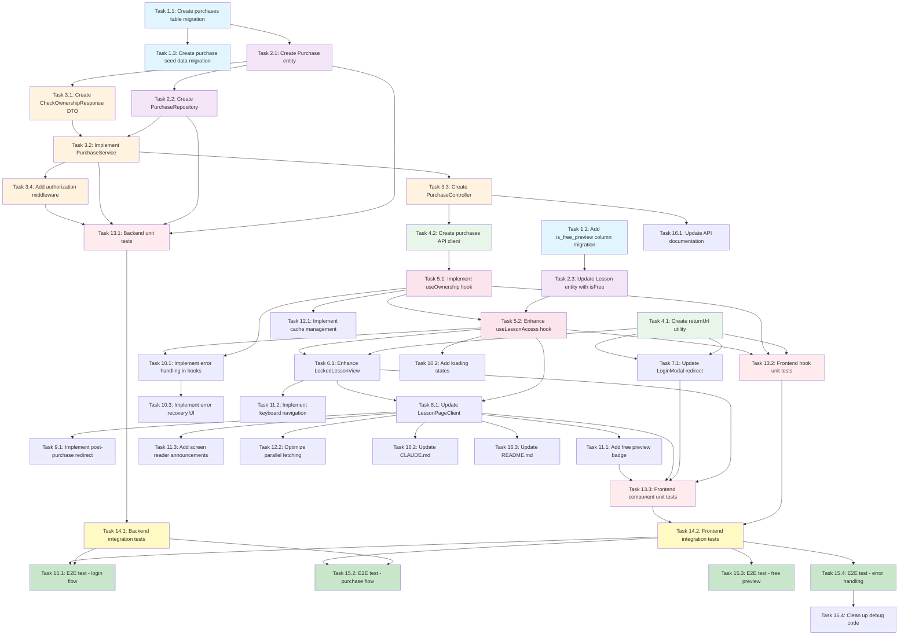

# Implementation Plan: Lesson Access Control

## Overview

This implementation plan provides a comprehensive, step-by-step approach to building the lesson access control system for WaterBallSA. The feature ensures that users can only view lessons they are authorized to access based on authentication status and course ownership.

**Key Principles:**
- Follow Test-Driven Development (TDD) - write tests before or alongside implementation
- Follow Specification-Driven Development (SDD) - database migrations before entities
- Build incrementally - each task builds on previous tasks
- All work done inside Docker containers
- Achieve >80% code coverage

---

## Implementation Tasks

### 1. Backend Database Layer

- [ ] 1.1 Create database migration for purchase system
  - Create Flyway migration file `V10__create_purchases_table.sql`
  - Define `purchases` table with columns: `id`, `user_id`, `curriculum_id`, `amount_paid`, `status`, `purchase_date`, `created_at`, `updated_at`
  - Add foreign key constraints to `users` and `curriculums` tables
  - Add unique constraint on `user_id + curriculum_id` to prevent duplicate purchases
  - Add indexes on `user_id` and `curriculum_id` for query performance
  - Test migration inside Docker: `docker-compose exec backend ./mvnw flyway:migrate`
  - _Requirements: 1.7, 2.6, 3.6, 4.6_

- [ ] 1.2 Create database migration for lesson free preview flag
  - Create Flyway migration file `V11__add_is_free_preview_to_lessons.sql`
  - Add `is_free_preview` boolean column to `lessons` table with default value `false`
  - Update existing seed data to mark specific lessons as free preview (e.g., first lesson in each curriculum)
  - Add index on `is_free_preview` for filtering queries
  - Test migration inside Docker: `docker-compose exec backend ./mvnw flyway:migrate`
  - _Requirements: 2.6, 2.7_

- [ ] 1.3 Create seed data for purchases
  - Create Flyway migration file `V12__insert_purchase_seed_data.sql`
  - Insert sample purchase records for testing (at least 3 different users, 5+ purchases)
  - Ensure seed purchases cover various scenarios: completed, pending, cancelled
  - Include purchases for different curriculums to test ownership checks
  - Test migration inside Docker: `docker-compose exec backend ./mvnw flyway:migrate`
  - _Requirements: 1.7, 4.6_

### 2. Backend Domain Models and Repositories

- [ ] 2.1 Create Purchase entity with relationships
  - Create JPA entity `Purchase.java` in `backend/src/main/java/com/waterballsa/backend/entity/`
  - Define fields: `id`, `user`, `curriculum`, `amountPaid`, `status` (enum), `purchaseDate`
  - Add `@ManyToOne` relationships to `User` and `Curriculum` entities
  - Use Lombok `@Data`, `@Builder`, `@NoArgsConstructor`, `@AllArgsConstructor` annotations
  - Add `@CreatedDate` and `@LastModifiedDate` audit fields
  - Create `PurchaseStatus` enum with values: `PENDING`, `COMPLETED`, `CANCELLED`
  - Write unit tests for entity validation and relationships in `PurchaseTest.java`
  - _Requirements: 1.7, 4.6_

- [ ] 2.2 Create PurchaseRepository with custom queries
  - Create Spring Data JPA repository `PurchaseRepository.java` in `backend/src/main/java/com/waterballsa/backend/repository/`
  - Add custom query: `findByUserIdAndCurriculumId(Long userId, Long curriculumId): Optional<Purchase>`
  - Add custom query: `existsByUserIdAndCurriculumIdAndStatus(Long userId, Long curriculumId, PurchaseStatus status): boolean`
  - Add custom query: `findAllByUserIdOrderByPurchaseDateDesc(Long userId): List<Purchase>`
  - Use `@Query` annotations with JPQL for complex queries
  - Write repository integration tests using TestContainers in `PurchaseRepositoryTest.java`
  - _Requirements: 1.7, 4.6_

- [ ] 2.3 Update Lesson entity to include isFree field
  - Modify `Lesson.java` entity in `backend/src/main/java/com/waterballsa/backend/entity/`
  - Add `@Column(name = "is_free_preview")` field with type `Boolean`
  - Update LessonDTO to include `isFree` field
  - Update existing unit tests to handle new field
  - Ensure existing lesson API endpoints return `isFree` in responses
  - _Requirements: 2.6, 2.7_

### 3. Backend API Layer - Purchase Endpoints

- [ ] 3.1 Create CheckOwnershipResponse DTO
  - Create DTO class `CheckOwnershipResponse.java` in `backend/src/main/java/com/waterballsa/backend/dto/`
  - Define fields: `owns` (boolean), `purchaseId` (Long, nullable), `purchaseDate` (LocalDateTime, nullable)
  - Add Lombok `@Data` and Jackson annotations for JSON serialization
  - Add JavaDoc comments explaining the response structure
  - _Requirements: 1.3, 4.6_

- [ ] 3.2 Implement PurchaseService with ownership checking
  - Create service class `PurchaseService.java` in `backend/src/main/java/com/waterballsa/backend/service/`
  - Implement method `checkOwnership(Long userId, Long curriculumId): CheckOwnershipResponse`
  - Use `PurchaseRepository` to query ownership by userId and curriculumId
  - Return `owns=true` only if purchase status is `COMPLETED`
  - Add business logic to handle edge cases (curriculum not found, user not found)
  - Write comprehensive unit tests for all scenarios in `PurchaseServiceTest.java`
  - Use Mockito to mock repository dependencies
  - _Requirements: 1.3, 1.7, 4.1-4.6_

- [ ] 3.3 Create PurchaseController with check-ownership endpoint
  - Create REST controller `PurchaseController.java` in `backend/src/main/java/com/waterballsa/backend/controller/`
  - Implement endpoint: `GET /api/purchases/check-ownership/{curriculumId}`
  - Use `@PreAuthorize` to require authentication
  - Extract current user from SecurityContext
  - Call `PurchaseService.checkOwnership()` and return DTO
  - Add OpenAPI/Swagger annotations for documentation
  - Handle exceptions: 401 (Unauthorized), 404 (Curriculum Not Found)
  - Write integration tests using `@SpringBootTest` and MockMvc in `PurchaseControllerTest.java`
  - Test authentication, authorization, and error responses
  - _Requirements: 1.1-1.6, 4.1-4.6_

- [ ] 3.4 Add authorization middleware for lesson content endpoints
  - Create `LessonAccessInterceptor.java` in `backend/src/main/java/com/waterballsa/backend/security/`
  - Implement `HandlerInterceptor` interface
  - In `preHandle()`, extract lessonId from request
  - Fetch lesson and check `isFree` flag
  - If `isFree=true`, allow access
  - If `isFree=false`, require authentication and verify ownership via `PurchaseService`
  - Throw `UnauthorizedException` (401) if not authenticated
  - Throw `ForbiddenException` (403) if authenticated but doesn't own curriculum
  - Register interceptor in `WebMvcConfigurer` for `/api/lessons/**` endpoints
  - Write unit tests for all authorization scenarios in `LessonAccessInterceptorTest.java`
  - _Requirements: 1.1-1.6, 2.1-2.7, 3.1-3.7, 4.1-4.6, Security NFR 1.1-1.4_

### 4. Frontend Utilities and API Clients

- [ ] 4.1 Create return URL utility module
  - Create utility file `/frontend/src/lib/utils/returnUrl.ts`
  - Implement `returnUrlUtils` object with methods: `store()`, `get()`, `clear()`, `isSafeURL()`
  - Store return URLs in sessionStorage with 30-minute expiry
  - Implement URL validation to prevent open redirect attacks (only allow relative URLs starting with `/`)
  - Reject protocol-relative URLs (`//evil.com`), `javascript:`, and `data:` URLs
  - Write comprehensive unit tests in `/frontend/src/lib/utils/__tests__/returnUrl.test.ts`
  - Test cases: store/get/clear, expiry, URL validation (safe/unsafe URLs)
  - _Requirements: 5.1-5.6, 6.1-6.6, Security NFR 1.2_

- [ ] 4.2 Create purchases API client module
  - Create API client file `/frontend/src/lib/api/purchases.ts`
  - Define TypeScript interfaces: `CheckOwnershipResponse`, `PurchaseHistoryItem`, `PurchaseHistoryResponse`
  - Implement `purchasesApi` object with methods: `checkOwnership()`, `getMyPurchases()`
  - Use `apiClient` wrapper to include JWT token in Authorization header
  - Add proper error handling with TypeScript error types
  - Write unit tests using Jest and axios mocks in `/frontend/src/lib/api/__tests__/purchases.test.ts`
  - Test success responses, error responses (401, 403, 404, 500), network errors
  - _Requirements: 1.3, 1.7_

### 5. Frontend Custom Hooks - Ownership and Access Control

- [ ] 5.1 Implement useOwnership hook with caching
  - Create hook file `/frontend/src/hooks/useOwnership.tsx`
  - Define TypeScript interface `OwnershipResult` with fields: `owns`, `purchaseId`, `purchaseDate`, `isLoading`, `error`, `retry()`
  - Implement hook that accepts `curriculumId` and `enabled` parameters
  - Use `useAuth` hook to get current user and access token
  - Check sessionStorage cache (key: `ownership_cache`) with 5-minute TTL
  - If cache miss or expired, fetch from API using `purchasesApi.checkOwnership()`
  - Store result in sessionStorage with timestamp
  - Implement retry mechanism with `retryCount` state
  - Listen for `curriculum-purchased` custom event to invalidate cache
  - Default to `owns=false` on errors (fail secure)
  - Write comprehensive unit tests in `/frontend/src/hooks/__tests__/useOwnership.test.tsx`
  - Test cases: loading state, authenticated/unauthenticated, cache hit/miss, errors, retry, event invalidation
  - _Requirements: 1.2-1.4, 4.1-4.6, Performance NFR 1.3_

- [ ] 5.2 Enhance useLessonAccess hook with ownership integration
  - Update existing hook file `/frontend/src/hooks/useLessonAccess.tsx`
  - Remove `userHasPurchased` prop parameter
  - Add internal call to `useOwnership(curriculumId, enabled: isAuthenticated)`
  - Update decision engine logic to follow priority order:
    1. If loading (auth or ownership) → return loading state
    2. If error → return locked state with error
    3. If user owns curriculum → grant access (reason: 'owned')
    4. If lesson is free preview (`isFree=true`) → grant access (reason: 'free_preview')
    5. If user authenticated → deny access (reason: 'requires_purchase')
    6. If user not authenticated → deny access (reason: 'requires_login')
  - Ensure `retry()` function refetches ownership
  - Update existing unit tests in `/frontend/src/hooks/__tests__/useLessonAccess.test.tsx`
  - Add new test cases for ownership integration, all decision paths, error handling
  - _Requirements: 1.1-1.6, 2.1-2.7, 3.1-3.7, 4.1-4.6_

### 6. Frontend Components - Locked Lesson View

- [ ] 6.1 Enhance LockedLessonView component with return URL handling
  - Update existing component `/frontend/src/components/LockedLessonView.tsx`
  - Add import for `returnUrlUtils`
  - In `onSignIn` handler, call `returnUrlUtils.store(window.location.pathname)` before triggering login
  - In `onPurchase` handler, call `returnUrlUtils.store(window.location.pathname)` before navigation
  - Ensure keyboard navigation support (Tab, Enter, Escape key handlers)
  - Add ARIA labels: `role="dialog"`, `aria-labelledby`, `aria-describedby`
  - Add focus management: auto-focus first button when rendered
  - Update existing tests in `/frontend/src/components/__tests__/LockedLessonView.test.tsx`
  - Add new test cases: return URL storage on click, keyboard navigation, ARIA attributes
  - _Requirements: 5.1-5.6, 6.1-6.6, 9.1-9.7, Accessibility NFR 1-7_

### 7. Frontend Authentication Flow - Return URL Redirect

- [ ] 7.1 Update LoginModal to handle post-login redirect
  - Modify existing component `/frontend/src/components/LoginModal.tsx`
  - After successful login (in `handleLoginSuccess` or equivalent), read return URL using `returnUrlUtils.get()`
  - If return URL exists and is valid, navigate to it using Next.js router: `router.push(returnUrl)`
  - If return URL missing or expired, navigate to home page: `router.push('/')`
  - Clear return URL after redirect: `returnUrlUtils.clear()`
  - Add URL validation before redirect to prevent open redirect attacks
  - Write unit tests in `/frontend/src/components/__tests__/LoginModal.redirect.test.tsx`
  - Test cases: redirect to stored URL, redirect to home if missing, URL validation, clear after redirect
  - _Requirements: 5.1-5.6, Security NFR 1.2_

### 8. Frontend Page Integration - Lesson Page

- [ ] 8.1 Update LessonPageClient to use enhanced access control
  - Modify existing component `/frontend/src/app/lessons/LessonPageClient.tsx`
  - Replace any manual ownership checks with `useLessonAccess(lessonId, curriculumId)`
  - Use destructured values: `{ canAccess, reason, freeToPreview, showLockedView, isLoading, error, retry }`
  - Render loading spinner while `isLoading=true`
  - Render error panel with retry button if `error` exists
  - Conditionally render content based on `canAccess`:
    - If `canAccess=true` → render VideoPlayer/ArticleRenderer/SurveyForm
    - If `showLockedView=true` → render LockedLessonView with appropriate props
  - Display "Free Preview" badge when `freeToPreview=true` and `reason='free_preview'`
  - Pass `curriculumId`, `curriculumTitle`, `curriculumPrice`, `isAuthenticated`, `reason` to LockedLessonView
  - Update existing tests in `/frontend/src/app/lessons/__tests__/LessonPageClient.test.tsx`
  - Add integration tests for all access scenarios: owned, free preview, requires login, requires purchase, loading, error
  - _Requirements: 1.1-1.6, 2.1-2.7, 3.1-3.7, 4.1-4.6, 9.1-9.7_

### 9. Frontend Purchase Flow Integration

- [ ] 9.1 Implement post-purchase redirect in curriculum page
  - Modify curriculum detail page or purchase completion handler
  - After successful purchase, dispatch custom event: `window.dispatchEvent(new CustomEvent('curriculum-purchased', { detail: { curriculumId } }))`
  - Clear ownership cache for purchased curriculum: `sessionStorage.removeItem('ownership_cache')`
  - Read return URL using `returnUrlUtils.get()`
  - If return URL exists and valid, navigate to it: `router.push(returnUrl)`
  - If return URL missing, stay on curriculum page or navigate to first lesson
  - Clear return URL after redirect: `returnUrlUtils.clear()`
  - Write integration tests to verify purchase event triggers cache invalidation and redirect
  - _Requirements: 6.1-6.6, Performance NFR 1.3_

### 10. Error Handling and User Experience

- [ ] 10.1 Implement comprehensive error handling in hooks
  - Update `useOwnership` hook to categorize errors by HTTP status code
  - Handle 401 Unauthorized: clear auth state, prompt re-login
  - Handle 403 Forbidden: fail secure (deny access), show purchase prompt
  - Handle 404 Not Found: show error message "Curriculum not found"
  - Handle 500/503 Server Error: show retry option with exponential backoff
  - Handle network errors: show connectivity message with retry
  - Implement retry with exponential backoff (1s, 2s, 4s) with max 3 retries
  - Update tests to verify each error scenario and recovery flow
  - _Requirements: 8.1-8.7_

- [ ] 10.2 Add loading states and skeleton screens
  - Create loading spinner component for access control checks
  - Display loading state in LessonPageClient while `isLoading=true`
  - Prevent content flashing by showing spinner before rendering locked view
  - Add loading skeleton for lesson content area
  - Test loading states with delayed API responses
  - _Requirements: 1.7, 9.7, Performance NFR 1.2_

- [ ] 10.3 Implement error recovery UI components
  - Create error panel component for access control errors
  - Display user-friendly error messages based on error type
  - Provide retry button that calls `retry()` function from hooks
  - Show max retries message after 3 failed attempts
  - Test error panel with various error scenarios
  - _Requirements: 8.1-8.7_

### 11. Visual Feedback and Accessibility

- [ ] 11.1 Add free preview badge to lesson content
  - Create badge component to display "Free Preview" label
  - Show badge when `freeToPreview=true` and lesson is accessible
  - Position badge near lesson title or breadcrumb
  - Use Chakra UI Badge component with appropriate color scheme
  - Add ARIA label for screen readers: "This is a free preview lesson"
  - Test badge visibility in different access scenarios
  - _Requirements: 2.4, 9.3_

- [ ] 11.2 Implement keyboard navigation for blocking panels
  - Add keyboard event listeners to LockedLessonView
  - Handle Tab key for focus navigation between buttons
  - Handle Enter/Space key to activate focused button
  - Handle Escape key to close panel or navigate back to curriculum page
  - Add visible focus indicators with sufficient contrast
  - Test keyboard navigation with automated tests and manual testing
  - _Requirements: 10.1-10.2, Accessibility NFR 1-2_

- [ ] 11.3 Add screen reader announcements for access state changes
  - Create utility function for screen reader announcements using ARIA live regions
  - Announce when access is granted: "Lesson content is now available"
  - Announce when access is denied: "This lesson is locked. Sign in or purchase to access."
  - Add ARIA labels to all interactive elements in LockedLessonView
  - Ensure color contrast meets WCAG AA standards for all UI elements
  - Test with screen readers (VoiceOver on macOS, NVDA on Windows)
  - _Requirements: 10.3-10.7, Accessibility NFR 1-7_

### 12. Caching and Performance Optimization

- [ ] 12.1 Implement ownership cache management
  - Ensure ownership cache uses sessionStorage (already implemented in useOwnership)
  - Verify cache TTL is 5 minutes
  - Implement cache invalidation on logout event
  - Implement cache invalidation on purchase event
  - Test cache hit/miss scenarios and measure performance improvement
  - _Requirements: 1.7, Performance NFR 1.1-1.3_

- [ ] 12.2 Optimize parallel data fetching in lesson page
  - Review SSR data fetching in lesson page (already using parallel fetching)
  - Ensure useOwnership and useLessonAccess run in parallel (they already do)
  - Measure and optimize API response times (target: <500ms for ownership check)
  - Add performance monitoring for access control checks
  - _Requirements: Performance NFR 1.1-1.3_

### 13. Testing - Unit Tests

- [ ] 13.1 Write comprehensive backend unit tests
  - Test Purchase entity validation and relationships
  - Test PurchaseRepository custom queries with various scenarios
  - Test PurchaseService business logic: ownership checking, edge cases, error handling
  - Test LessonAccessInterceptor authorization logic for all scenarios
  - Achieve >80% code coverage for backend components
  - Run tests inside Docker: `docker-compose exec backend ./mvnw test`
  - _Requirements: All requirements, Success Metrics 1.5_

- [ ] 13.2 Write comprehensive frontend unit tests for hooks
  - Test useOwnership hook: loading, cache, API calls, errors, retry, events
  - Test useLessonAccess hook: all decision paths, ownership integration, error handling
  - Test returnUrl utility: store, get, clear, expiry, URL validation
  - Use React Testing Library and Jest for hook testing
  - Mock API calls with axios-mock-adapter or MSW
  - Achieve >80% code coverage for hooks
  - Run tests inside Docker: `docker-compose exec frontend yarn test`
  - _Requirements: All requirements, Success Metrics 1.5_

- [ ] 13.3 Write comprehensive frontend unit tests for components
  - Test LockedLessonView: rendering, button clicks, return URL storage, keyboard nav, ARIA
  - Test LoginModal redirect logic: return URL handling, validation, clearing
  - Test LessonPageClient: all access scenarios, conditional rendering, error states
  - Test free preview badge component
  - Achieve >80% code coverage for components
  - Run tests inside Docker: `docker-compose exec frontend yarn test`
  - _Requirements: All requirements, Success Metrics 1.5_

### 14. Testing - Integration Tests

- [ ] 14.1 Write backend integration tests with TestContainers
  - Test complete ownership check flow: API endpoint → Service → Repository → Database
  - Test lesson access interceptor with real HTTP requests
  - Test authentication and authorization scenarios
  - Test error responses (401, 403, 404, 500)
  - Use TestContainers for real PostgreSQL instance
  - Run tests inside Docker: `docker-compose exec backend ./mvnw verify`
  - _Requirements: All requirements_

- [ ] 14.2 Write frontend integration tests for access flows
  - Test complete access flow: authenticated user owns curriculum → sees content
  - Test complete access flow: authenticated user doesn't own → sees purchase prompt
  - Test complete access flow: unauthenticated user → sees login prompt
  - Test complete access flow: free preview lesson → sees content with badge
  - Test error handling: API errors, network errors, retry flow
  - Test cache behavior: cache hit, cache miss, cache invalidation
  - Use React Testing Library with mocked API responses
  - Run tests inside Docker: `docker-compose exec frontend yarn test`
  - _Requirements: All requirements_

### 15. Testing - End-to-End Tests

- [ ] 15.1 Write E2E test for login flow from locked lesson
  - Use Playwright to automate test
  - Navigate to locked lesson as unauthenticated user
  - Verify "Sign In" button is visible
  - Click "Sign In" and complete OAuth flow (mocked)
  - Verify redirect back to lesson page
  - Verify access re-evaluated (may still be locked if not owned)
  - Run test inside Docker: `docker-compose exec frontend yarn test:e2e`
  - _Requirements: 5.1-5.6_

- [ ] 15.2 Write E2E test for purchase flow from locked lesson
  - Use Playwright to automate test
  - Navigate to locked lesson as authenticated non-owner
  - Verify "Purchase for $X.XX" button is visible
  - Click purchase button and verify navigation to curriculum page
  - Complete purchase flow (simplified mock for Phase 2)
  - Verify redirect back to lesson page
  - Verify lesson content is now accessible (no blocking panel)
  - Run test inside Docker: `docker-compose exec frontend yarn test:e2e`
  - _Requirements: 6.1-6.6_

- [ ] 15.3 Write E2E test for free preview lesson access
  - Use Playwright to automate test
  - Navigate to free preview lesson as unauthenticated user
  - Verify lesson content is visible (no blocking panel)
  - Verify "Free Preview" badge is displayed
  - Navigate to free preview lesson as authenticated non-owner
  - Verify content is still accessible
  - Run test inside Docker: `docker-compose exec frontend yarn test:e2e`
  - _Requirements: 2.1-2.7_

- [ ] 15.4 Write E2E test for error handling and retry
  - Use Playwright to automate test
  - Mock API to return 500 error for ownership check
  - Navigate to lesson page
  - Verify error message is displayed with retry button
  - Click retry button
  - Mock API to return success response
  - Verify lesson access is re-evaluated correctly
  - Run test inside Docker: `docker-compose exec frontend yarn test:e2e`
  - _Requirements: 8.1-8.7_

### 16. Documentation and Cleanup

- [ ] 16.1 Update API documentation (Swagger/OpenAPI)
  - Add comprehensive Swagger annotations to PurchaseController
  - Document request/response schemas for check-ownership endpoint
  - Document authentication requirements (JWT Bearer token)
  - Document error responses (401, 403, 404, 500)
  - Verify Swagger UI at `http://localhost:8081/swagger-ui.html` shows new endpoints
  - _Requirements: All requirements_

- [ ] 16.2 Update CLAUDE.md with new features
  - Document new API endpoints (`GET /api/purchases/check-ownership/:id`)
  - Document new database tables and migrations (purchases, is_free_preview)
  - Document new frontend hooks (useOwnership, enhanced useLessonAccess)
  - Document caching strategy and return URL handling
  - Update testing strategy section with new test files
  - Update common commands for running ownership-related tests
  - _Requirements: All requirements_

- [ ] 16.3 Update README.md if needed
  - Add lesson access control to feature list
  - Update setup instructions if environment variables changed
  - Document any new configuration required
  - _Requirements: All requirements_

- [ ] 16.4 Clean up console logs and debug code
  - Remove or comment out debug console.log statements
  - Keep only production-ready logging (errors, warnings, critical info)
  - Ensure no sensitive data is logged (tokens, user IDs in plain text)
  - _Requirements: Security NFR_

---

## Task Dependency Diagram

This diagram shows task dependencies to facilitate understanding of the implementation flow. Tasks can be executed in parallel if they have no direct dependency arrows between them.

**Legend:**
- 🔵 Light Blue: Database migrations (Foundation)
- 🟣 Purple: Backend entities and repositories
- 🟠 Orange: Backend services and controllers
- 🟢 Green: Frontend utilities and API clients
- 🔴 Pink: Frontend hooks (state management)
- ❤️ Light Red: Unit tests
- 🟡 Yellow: Integration tests
- 💚 Light Green: E2E tests

---

## Completion Criteria

Before marking this feature as complete, verify:

- [ ] All database migrations created, tested, and applied successfully
- [ ] All backend entities, repositories, services, and controllers implemented
- [ ] Backend authorization middleware working correctly
- [ ] All frontend hooks (useOwnership, useLessonAccess) implemented with caching
- [ ] All frontend components (LockedLessonView, LoginModal) enhanced
- [ ] LessonPageClient integrated with access control
- [ ] Return URL handling implemented and tested
- [ ] Post-purchase redirect flow working
- [ ] Error handling comprehensive and user-friendly
- [ ] Loading states prevent content flashing
- [ ] Free preview badge displayed correctly
- [ ] Keyboard navigation fully functional
- [ ] Screen reader support implemented with ARIA labels
- [ ] All unit tests passing with >80% coverage
- [ ] All integration tests passing
- [ ] All E2E tests passing
- [ ] API documentation updated (Swagger UI)
- [ ] CLAUDE.md updated with new features
- [ ] No security vulnerabilities (open redirect, XSS, token exposure)
- [ ] All tests run successfully inside Docker containers
- [ ] Performance metrics met (ownership check < 500ms, cache hit rate > 80%)

---

## Notes

- **Docker First**: All commands should run inside Docker containers (`docker-compose exec backend ...` or `docker-compose exec frontend ...`)
- **TDD Approach**: Write tests before or alongside implementation code
- **Incremental Development**: Each task builds on previous tasks - follow the order
- **Fail Secure**: When in doubt, deny access rather than grant it
- **Backend Authority**: Backend is the source of truth for authorization decisions
- **Cache Wisely**: Use sessionStorage for ownership (5-min TTL) to balance performance and freshness
- **Accessibility**: Ensure keyboard navigation and screen reader support throughout
- **Security**: Validate all return URLs, prevent open redirects, never expose tokens in logs

**Remember**: This is a critical security feature. Thorough testing and careful implementation are essential to protect premium content while providing a smooth user experience.
