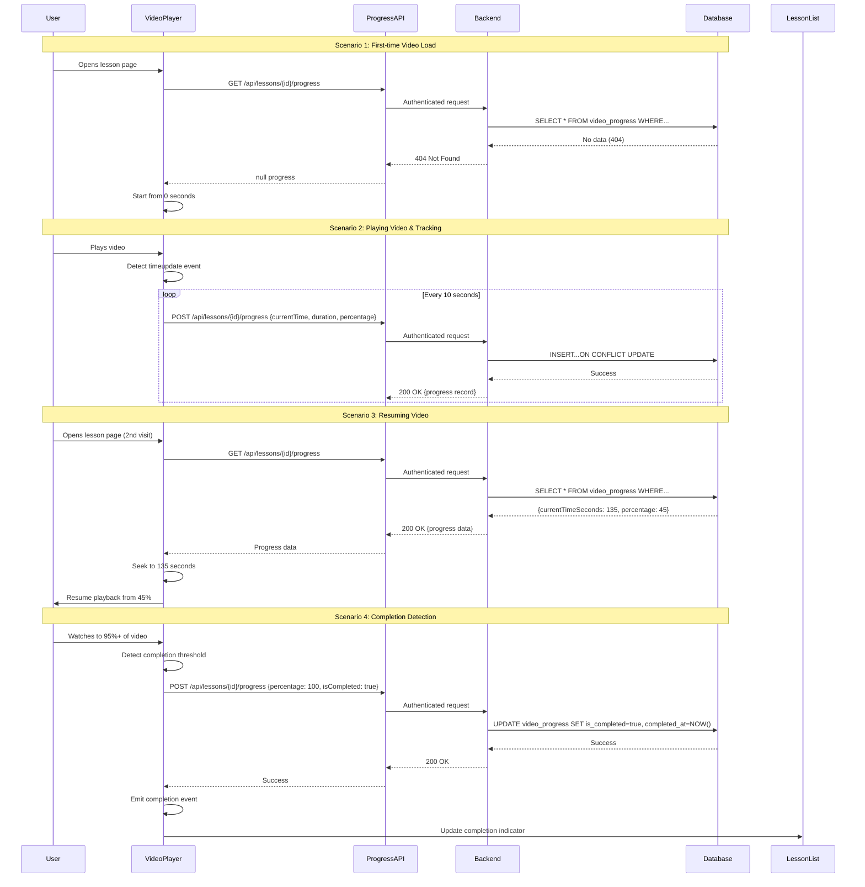
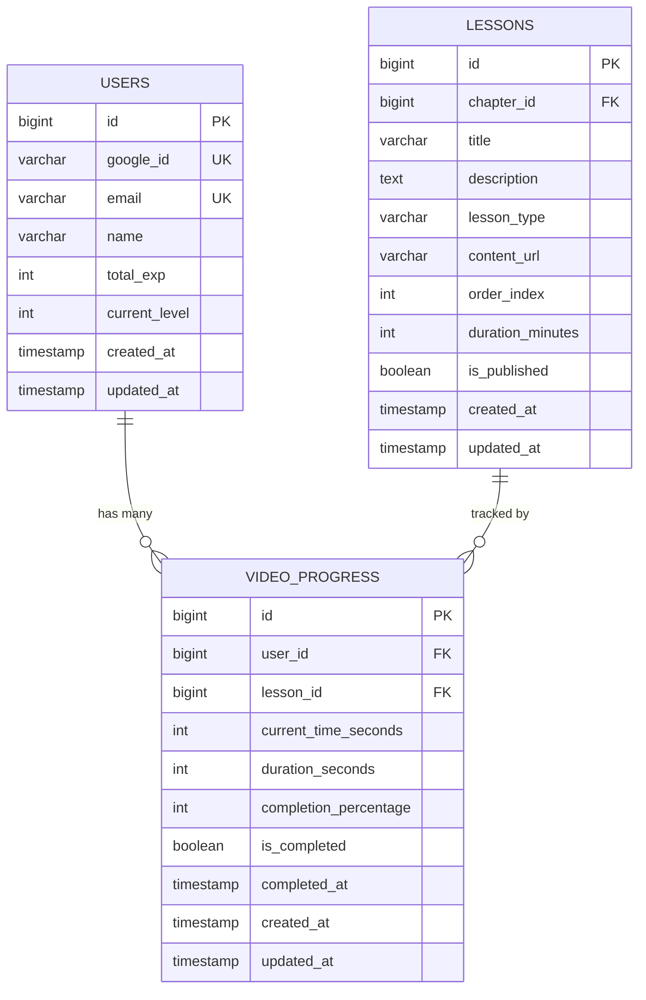
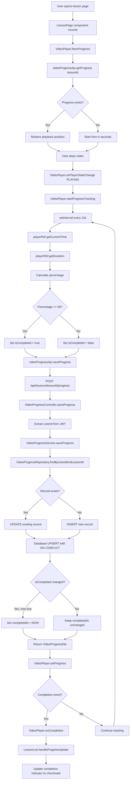
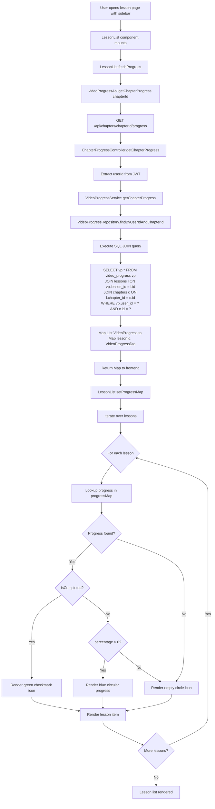
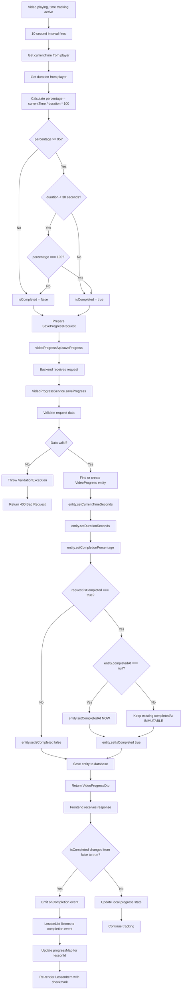
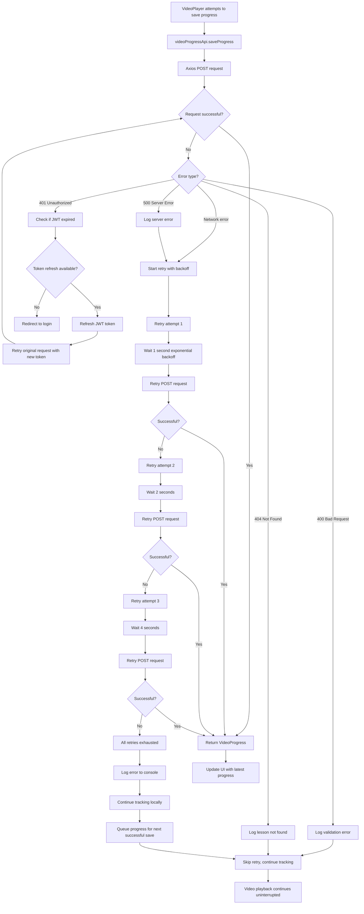

# Video Progress Tracking - Design Document v1

## Overview

This design document specifies the technical architecture for implementing video progress tracking in the WaterBallSA learning platform. The system enables automatic recording of video playback progress, lesson completion detection, and progress restoration across sessions.

### Design Goals

1. **Automatic Progress Tracking**: Record video playback position every 10 seconds without user intervention
2. **Seamless Resume Experience**: Restore playback position when users return to partially watched videos
3. **Completion Detection**: Automatically mark lessons complete at 95% playback threshold
4. **Performance**: Handle 100+ concurrent users with <200ms API response times
5. **Reliability**: Implement retry logic and graceful degradation for network failures
6. **User Experience**: Non-intrusive tracking that doesn't impact video playback quality

### Scope

**In Scope:**
- Video lesson progress tracking (VIDEO lesson type only)
- Database schema for video_progress table
- Backend REST API endpoints for save/retrieve progress
- Frontend integration with existing VideoPlayer component
- Completion indicators in lesson list UI
- Bulk progress retrieval for chapter views
- Authentication and authorization with JWT

**Out of Scope:**
- Progress tracking for ARTICLE and SURVEY lesson types
- Offline progress tracking
- Progress analytics dashboard
- Cross-device conflict resolution (uses last-write-wins)
- Admin UI for manual progress adjustment

---

## Architecture Design

### System Architecture Diagram

```mermaid
graph TB
    subgraph "Frontend (Next.js)"
        A[VideoPlayer Component]
        B[LessonList Component]
        C[Progress API Client]
        D[Auth Context]
    end

    subgraph "Backend (Spring Boot)"
        E[VideoProgressController]
        F[VideoProgressService]
        G[VideoProgressRepository]
        H[JwtAuthenticationFilter]
    end

    subgraph "Database (PostgreSQL)"
        I[video_progress table]
        J[users table]
        K[lessons table]
    end

    A -->|Save Progress Every 10s| C
    A -->|Fetch Progress on Load| C
    B -->|Fetch Chapter Progress| C
    C -->|POST /api/lessons/{id}/progress| E
    C -->|GET /api/lessons/{id}/progress| E
    C -->|GET /api/chapters/{id}/progress| E
    D -->|JWT Token| C

    E -->|Validate JWT| H
    E -->|Business Logic| F
    F -->|CRUD Operations| G
    G -->|Query/Upsert| I

    I -->|FK user_id| J
    I -->|FK lesson_id| K

    style A fill:#60a5fa
    style E fill:#34d399
    style I fill:#fbbf24
```

### Data Flow Diagram



---

## Component Design

### Backend Components

#### 1. Entity: `VideoProgress`

**Location:** `backend/src/main/java/com/waterballsa/backend/entity/VideoProgress.java`

**Responsibilities:**
- Represent video_progress table as JPA entity
- Enforce validation constraints
- Provide business methods for completion detection

**Key Fields:**
- `id: Long` - Primary key (auto-increment)
- `user: User` - ManyToOne relationship to User entity
- `lesson: Lesson` - ManyToOne relationship to Lesson entity
- `currentTimeSeconds: Integer` - Current playback position (0 to duration)
- `durationSeconds: Integer` - Total video duration in seconds
- `completionPercentage: Integer` - Calculated percentage (0-100)
- `isCompleted: Boolean` - Completion flag (default: false)
- `completedAt: LocalDateTime` - Timestamp when marked complete (nullable)
- `createdAt: LocalDateTime` - Auto-managed by @CreatedDate
- `updatedAt: LocalDateTime` - Auto-managed by @LastModifiedDate

**Methods:**
```java
public void updateProgress(int currentTime, int duration);
public void markAsComplete();
public boolean hasReachedCompletionThreshold(); // 95% check
```

**Annotations:**
- `@Entity`, `@Table(name = "video_progress")`
- `@EntityListeners(AuditingEntityListener.class)`
- Unique constraint on `(user_id, lesson_id)`
- Foreign keys with `ON DELETE CASCADE`

---

#### 2. Repository: `VideoProgressRepository`

**Location:** `backend/src/main/java/com/waterballsa/backend/repository/VideoProgressRepository.java`

**Responsibilities:**
- Provide database access methods
- Execute custom queries for bulk operations
- Extend Spring Data JPA repository

**Interface:**
```java
public interface VideoProgressRepository extends JpaRepository<VideoProgress, Long> {

    /**
     * Find progress for a specific user and lesson
     */
    Optional<VideoProgress> findByUserIdAndLessonId(Long userId, Long lessonId);

    /**
     * Find all progress records for lessons in a specific chapter
     * Uses JOIN to fetch lesson.chapter relationship
     */
    @Query("SELECT vp FROM VideoProgress vp " +
           "JOIN FETCH vp.lesson l " +
           "JOIN FETCH l.chapter c " +
           "WHERE vp.user.id = :userId AND c.id = :chapterId")
    List<VideoProgress> findByUserIdAndChapterId(Long userId, Long chapterId);

    /**
     * Find all completed lessons for a user
     */
    List<VideoProgress> findByUserIdAndIsCompletedTrue(Long userId);

    /**
     * Count completed lessons in a curriculum
     */
    @Query("SELECT COUNT(vp) FROM VideoProgress vp " +
           "JOIN vp.lesson l " +
           "JOIN l.chapter c " +
           "WHERE vp.user.id = :userId AND c.curriculum.id = :curriculumId AND vp.isCompleted = true")
    Long countCompletedLessonsInCurriculum(Long userId, Long curriculumId);

    /**
     * Delete all progress for a user (for GDPR compliance)
     */
    void deleteByUserId(Long userId);
}
```

---

#### 3. Service: `VideoProgressService`

**Location:** `backend/src/main/java/com/waterballsa/backend/service/VideoProgressService.java`

**Responsibilities:**
- Implement business logic for progress tracking
- Handle upsert operations (insert or update)
- Calculate completion percentages
- Validate data integrity
- Manage transactions

**Key Methods:**

```java
@Service
@RequiredArgsConstructor
@Slf4j
public class VideoProgressService {

    private final VideoProgressRepository videoProgressRepository;
    private final LessonRepository lessonRepository;
    private final UserRepository userRepository;

    /**
     * Save or update video progress for a user
     *
     * @param userId - Authenticated user ID from JWT
     * @param lessonId - Video lesson ID
     * @param request - Progress update request DTO
     * @return Updated VideoProgressDto
     * @throws ResourceNotFoundException if lesson or user not found
     * @throws ValidationException if data invalid
     */
    @Transactional
    public VideoProgressDto saveProgress(Long userId, Long lessonId, SaveProgressRequest request);

    /**
     * Retrieve progress for a specific lesson
     *
     * @param userId - Authenticated user ID
     * @param lessonId - Video lesson ID
     * @return VideoProgressDto or null if not found
     * @throws ResourceNotFoundException if lesson doesn't exist
     */
    @Transactional(readOnly = true)
    public VideoProgressDto getProgress(Long userId, Long lessonId);

    /**
     * Retrieve progress for all lessons in a chapter
     *
     * @param userId - Authenticated user ID
     * @param chapterId - Chapter ID
     * @return Map of lessonId -> VideoProgressDto
     */
    @Transactional(readOnly = true)
    public Map<Long, VideoProgressDto> getChapterProgress(Long userId, Long chapterId);

    /**
     * Get completion statistics for a curriculum
     *
     * @param userId - Authenticated user ID
     * @param curriculumId - Curriculum ID
     * @return Statistics DTO (total lessons, completed count, percentage)
     */
    @Transactional(readOnly = true)
    public CurriculumProgressStats getCurriculumStats(Long userId, Long curriculumId);
}
```

**Business Rules:**
1. Completion threshold: `completionPercentage >= 95`
2. Videos under 30 seconds require 100% playback
3. `completedAt` timestamp is immutable once set
4. `currentTimeSeconds` capped at `durationSeconds`
5. `completionPercentage` validated between 0-100

---

#### 4. Controller: `VideoProgressController`

**Location:** `backend/src/main/java/com/waterballsa/backend/controller/VideoProgressController.java`

**Responsibilities:**
- Expose REST API endpoints
- Handle HTTP requests/responses
- Extract user ID from JWT token
- Validate request payloads
- Document API with OpenAPI annotations

**Endpoints:**

```java
@RestController
@RequestMapping("/api/lessons")
@RequiredArgsConstructor
@Slf4j
@Tag(name = "Video Progress", description = "Video progress tracking endpoints")
public class VideoProgressController {

    private final VideoProgressService videoProgressService;

    /**
     * POST /api/lessons/{lessonId}/progress
     * Save or update video progress
     *
     * Request Body:
     * {
     *   "currentTimeSeconds": 135,
     *   "durationSeconds": 300,
     *   "completionPercentage": 45,
     *   "isCompleted": false
     * }
     *
     * Response: 200 OK with VideoProgressDto
     * Error Responses: 400 (validation), 401 (unauthorized), 404 (lesson not found)
     */
    @PostMapping("/{lessonId}/progress")
    @Operation(summary = "Save video progress", description = "Save or update playback progress")
    public ResponseEntity<VideoProgressDto> saveProgress(
            @PathVariable Long lessonId,
            @Valid @RequestBody SaveProgressRequest request,
            @AuthenticationPrincipal UserDetails userDetails
    );

    /**
     * GET /api/lessons/{lessonId}/progress
     * Retrieve video progress for authenticated user
     *
     * Response: 200 OK with VideoProgressDto
     * Error Responses: 401 (unauthorized), 404 (no progress found)
     */
    @GetMapping("/{lessonId}/progress")
    @Operation(summary = "Get video progress", description = "Retrieve progress for a specific lesson")
    public ResponseEntity<VideoProgressDto> getProgress(
            @PathVariable Long lessonId,
            @AuthenticationPrincipal UserDetails userDetails
    );
}

@RestController
@RequestMapping("/api/chapters")
@Tag(name = "Video Progress")
public class ChapterProgressController {

    /**
     * GET /api/chapters/{chapterId}/progress
     * Retrieve progress for all lessons in a chapter
     *
     * Response: 200 OK with Map<Long, VideoProgressDto>
     * Error Responses: 401 (unauthorized)
     */
    @GetMapping("/{chapterId}/progress")
    @Operation(summary = "Get chapter progress", description = "Bulk retrieve progress for all lessons in chapter")
    public ResponseEntity<Map<Long, VideoProgressDto>> getChapterProgress(
            @PathVariable Long chapterId,
            @AuthenticationPrincipal UserDetails userDetails
    );
}
```

**Security:**
- All endpoints require JWT authentication
- User ID extracted from JWT token via `@AuthenticationPrincipal`
- Users can only access their own progress data
- Spring Security configured in `SecurityConfig.java`

---

#### 5. DTOs

**Location:** `backend/src/main/java/com/waterballsa/backend/dto/`

##### `SaveProgressRequest`
```java
@Data
@NoArgsConstructor
@AllArgsConstructor
public class SaveProgressRequest {

    @NotNull(message = "Current time is required")
    @PositiveOrZero(message = "Current time must be non-negative")
    private Integer currentTimeSeconds;

    @NotNull(message = "Duration is required")
    @Positive(message = "Duration must be positive")
    private Integer durationSeconds;

    @NotNull(message = "Completion percentage is required")
    @Min(value = 0, message = "Completion percentage must be at least 0")
    @Max(value = 100, message = "Completion percentage must not exceed 100")
    private Integer completionPercentage;

    @NotNull(message = "Completion flag is required")
    private Boolean isCompleted;
}
```

##### `VideoProgressDto`
```java
@Data
@Builder
@NoArgsConstructor
@AllArgsConstructor
public class VideoProgressDto {

    private Long id;
    private Long userId;
    private Long lessonId;
    private Integer currentTimeSeconds;
    private Integer durationSeconds;
    private Integer completionPercentage;
    private Boolean isCompleted;
    private LocalDateTime completedAt;
    private LocalDateTime createdAt;
    private LocalDateTime updatedAt;

    public static VideoProgressDto from(VideoProgress entity) {
        return VideoProgressDto.builder()
                .id(entity.getId())
                .userId(entity.getUser().getId())
                .lessonId(entity.getLesson().getId())
                .currentTimeSeconds(entity.getCurrentTimeSeconds())
                .durationSeconds(entity.getDurationSeconds())
                .completionPercentage(entity.getCompletionPercentage())
                .isCompleted(entity.getIsCompleted())
                .completedAt(entity.getCompletedAt())
                .createdAt(entity.getCreatedAt())
                .updatedAt(entity.getUpdatedAt())
                .build();
    }
}
```

##### `CurriculumProgressStats`
```java
@Data
@Builder
public class CurriculumProgressStats {
    private Long curriculumId;
    private Integer totalLessons;
    private Integer completedLessons;
    private Integer completionPercentage;
}
```

---

### Frontend Components

#### 1. Enhanced VideoPlayer Component

**Location:** `frontend/src/components/VideoPlayer.tsx`

**Responsibilities:**
- Integrate YouTube iframe API for time tracking
- Fetch progress on mount and restore playback position
- Save progress every 10 seconds via throttled updates
- Detect completion threshold (95%) and mark complete
- Handle network errors with retry logic
- Emit completion events for UI updates

**Key Enhancements:**

```typescript
interface VideoPlayerProps {
  videoUrl: string
  title: string
  duration?: number
  lessonId: number // NEW: Required for progress tracking
  onProgressUpdate?: (progress: VideoProgress) => void // NEW: Callback for UI updates
  onCompletion?: (lessonId: number) => void // NEW: Completion event
}

// NEW: State for progress tracking
const [progress, setProgress] = useState<VideoProgress | null>(null)
const [isLoadingProgress, setIsLoadingProgress] = useState(true)
const playerRef = useRef<YT.Player | null>(null)
const saveTimeoutRef = useRef<NodeJS.Timeout | null>(null)

// NEW: YouTube iframe API integration
useEffect(() => {
  // Load YouTube iframe API script
  loadYouTubeIframeAPI()
}, [])

// NEW: Fetch progress on mount
useEffect(() => {
  fetchProgress()
}, [lessonId])

// NEW: Initialize player with progress restoration
const onPlayerReady = (event: YT.PlayerEvent) => {
  playerRef.current = event.target

  // Restore playback position if progress exists
  if (progress && progress.currentTimeSeconds > 0) {
    const duration = event.target.getDuration()
    // Don't restore if within 10s of end
    if (progress.currentTimeSeconds < duration - 10) {
      event.target.seekTo(progress.currentTimeSeconds, true)
    }
  }
}

// NEW: Track time updates
const onPlayerStateChange = (event: YT.OnStateChangeEvent) => {
  if (event.data === YT.PlayerState.PLAYING) {
    startProgressTracking()
  } else if (event.data === YT.PlayerState.PAUSED) {
    saveProgressImmediately()
  }
}

// NEW: Throttled progress tracking (every 10s)
const startProgressTracking = () => {
  if (saveTimeoutRef.current) {
    clearInterval(saveTimeoutRef.current)
  }

  saveTimeoutRef.current = setInterval(() => {
    if (playerRef.current) {
      const currentTime = Math.floor(playerRef.current.getCurrentTime())
      const duration = Math.floor(playerRef.current.getDuration())
      const percentage = Math.floor((currentTime / duration) * 100)

      saveProgress(currentTime, duration, percentage)
    }
  }, 10000) // Every 10 seconds
}

// NEW: Save progress with retry logic
const saveProgress = async (
  currentTime: number,
  duration: number,
  percentage: number
) => {
  const isCompleted = percentage >= 95 || (duration < 30 && percentage === 100)

  try {
    const updated = await videoProgressApi.saveProgress(lessonId, {
      currentTimeSeconds: currentTime,
      durationSeconds: duration,
      completionPercentage: percentage,
      isCompleted
    })

    setProgress(updated)
    onProgressUpdate?.(updated)

    if (isCompleted && !progress?.isCompleted) {
      onCompletion?.(lessonId)
    }
  } catch (error) {
    console.error('Failed to save progress:', error)
    // Retry with exponential backoff
    retryWithBackoff(() => saveProgress(currentTime, duration, percentage))
  }
}

// NEW: Cleanup on unmount
useEffect(() => {
  return () => {
    if (saveTimeoutRef.current) {
      clearInterval(saveTimeoutRef.current)
    }
    saveProgressImmediately()
  }
}, [])
```

**Integration Strategy:**
1. Load YouTube iframe API dynamically
2. Replace static iframe with YouTube Player API instance
3. Add event listeners for `onReady`, `onStateChange`
4. Use `postMessage` API to communicate with iframe
5. Implement throttled time tracking with `setInterval`
6. Handle component lifecycle (mount, unmount, navigation)

---

#### 2. Progress API Client

**Location:** `frontend/src/lib/api/videoProgress.ts`

**Responsibilities:**
- Provide TypeScript API client for progress endpoints
- Handle authentication headers
- Implement retry logic with exponential backoff
- Type-safe request/response interfaces

**Implementation:**

```typescript
import { apiClient } from '../api-client'
import type { VideoProgress, SaveProgressRequest } from '@/types'

export const videoProgressApi = {
  /**
   * Save or update video progress
   */
  async saveProgress(
    lessonId: number,
    request: SaveProgressRequest
  ): Promise<VideoProgress> {
    const { data } = await apiClient.post<VideoProgress>(
      `/lessons/${lessonId}/progress`,
      request
    )
    return data
  },

  /**
   * Get video progress for a lesson
   */
  async getProgress(lessonId: number): Promise<VideoProgress | null> {
    try {
      const { data } = await apiClient.get<VideoProgress>(
        `/lessons/${lessonId}/progress`
      )
      return data
    } catch (error) {
      if (error.response?.status === 404) {
        return null // No progress found
      }
      throw error
    }
  },

  /**
   * Get progress for all lessons in a chapter
   */
  async getChapterProgress(
    chapterId: number
  ): Promise<Record<number, VideoProgress>> {
    const { data } = await apiClient.get<Record<number, VideoProgress>>(
      `/chapters/${chapterId}/progress`
    )
    return data
  },
}

/**
 * Retry helper with exponential backoff
 */
export async function retryWithBackoff<T>(
  fn: () => Promise<T>,
  maxRetries = 3,
  baseDelay = 1000
): Promise<T> {
  let lastError: Error

  for (let i = 0; i < maxRetries; i++) {
    try {
      return await fn()
    } catch (error) {
      lastError = error
      const delay = baseDelay * Math.pow(2, i)
      await new Promise(resolve => setTimeout(resolve, delay))
    }
  }

  throw lastError
}
```

---

#### 3. Lesson List with Completion Indicators

**Location:** `frontend/src/components/LessonList.tsx` (new) or integrate into existing sidebar

**Responsibilities:**
- Display lesson list for a chapter
- Show completion indicators (checkmark, progress %, empty circle)
- Fetch bulk progress on mount
- Update indicators in real-time when VideoPlayer emits completion

**Component Design:**

```typescript
interface LessonListProps {
  chapterId: number
  lessons: Lesson[]
  currentLessonId?: number
}

export function LessonList({ chapterId, lessons, currentLessonId }: LessonListProps) {
  const [progressMap, setProgressMap] = useState<Record<number, VideoProgress>>({})
  const [isLoading, setIsLoading] = useState(true)

  // Fetch progress for all lessons in chapter
  useEffect(() => {
    async function fetchProgress() {
      try {
        const progress = await videoProgressApi.getChapterProgress(chapterId)
        setProgressMap(progress)
      } catch (error) {
        console.error('Failed to load progress:', error)
      } finally {
        setIsLoading(false)
      }
    }

    fetchProgress()
  }, [chapterId])

  // Update progress when VideoPlayer completes a lesson
  const handleProgressUpdate = (lessonId: number, progress: VideoProgress) => {
    setProgressMap(prev => ({
      ...prev,
      [lessonId]: progress
    }))
  }

  return (
    <VStack align="stretch" spacing={2}>
      {lessons.map(lesson => {
        const progress = progressMap[lesson.id]
        const isCompleted = progress?.isCompleted
        const percentage = progress?.completionPercentage || 0

        return (
          <LessonItem
            key={lesson.id}
            lesson={lesson}
            isActive={currentLessonId === lesson.id}
            isCompleted={isCompleted}
            progressPercentage={percentage}
            completedAt={progress?.completedAt}
          />
        )
      })}
    </VStack>
  )
}

function LessonItem({ lesson, isActive, isCompleted, progressPercentage, completedAt }) {
  return (
    <Box
      p={3}
      bg={isActive ? 'blue.50' : 'white'}
      borderLeft={isActive ? '4px solid' : 'none'}
      borderColor="blue.500"
      cursor="pointer"
      _hover={{ bg: 'gray.50' }}
    >
      <HStack justify="space-between">
        <Text fontWeight={isActive ? 'semibold' : 'normal'}>
          {lesson.title}
        </Text>

        <CompletionIndicator
          isCompleted={isCompleted}
          percentage={progressPercentage}
          completedAt={completedAt}
        />
      </HStack>
    </Box>
  )
}

function CompletionIndicator({ isCompleted, percentage, completedAt }) {
  if (isCompleted) {
    return (
      <Tooltip label={`Completed on ${formatDate(completedAt)}`}>
        <Icon as={CheckCircleIcon} color="green.500" boxSize={5} />
      </Tooltip>
    )
  }

  if (percentage > 0 && percentage < 95) {
    return (
      <Tooltip label={`${percentage}% complete`}>
        <CircularProgress value={percentage} size="20px" color="blue.400" />
      </Tooltip>
    )
  }

  return (
    <Icon as={CircleIcon} color="gray.300" boxSize={5} />
  )
}
```

---

#### 4. TypeScript Type Definitions

**Location:** `frontend/src/types/index.ts`

```typescript
export interface VideoProgress {
  id: number
  userId: number
  lessonId: number
  currentTimeSeconds: number
  durationSeconds: number
  completionPercentage: number
  isCompleted: boolean
  completedAt: string | null // ISO 8601 format
  createdAt: string
  updatedAt: string
}

export interface SaveProgressRequest {
  currentTimeSeconds: number
  durationSeconds: number
  completionPercentage: number
  isCompleted: boolean
}

export interface CurriculumProgressStats {
  curriculumId: number
  totalLessons: number
  completedLessons: number
  completionPercentage: number
}
```

---

## Data Model

### Database Schema

#### `video_progress` Table

```sql
CREATE TABLE video_progress (
    id BIGSERIAL PRIMARY KEY,
    user_id BIGINT NOT NULL,
    lesson_id BIGINT NOT NULL,
    current_time_seconds INTEGER NOT NULL DEFAULT 0,
    duration_seconds INTEGER NOT NULL,
    completion_percentage INTEGER NOT NULL DEFAULT 0,
    is_completed BOOLEAN NOT NULL DEFAULT FALSE,
    completed_at TIMESTAMP,
    created_at TIMESTAMP NOT NULL DEFAULT CURRENT_TIMESTAMP,
    updated_at TIMESTAMP NOT NULL DEFAULT CURRENT_TIMESTAMP,

    -- Constraints
    CONSTRAINT video_progress_user_lesson_unique UNIQUE (user_id, lesson_id),
    CONSTRAINT fk_video_progress_user FOREIGN KEY (user_id)
        REFERENCES users(id) ON DELETE CASCADE,
    CONSTRAINT fk_video_progress_lesson FOREIGN KEY (lesson_id)
        REFERENCES lessons(id) ON DELETE CASCADE,
    CONSTRAINT check_current_time_non_negative
        CHECK (current_time_seconds >= 0),
    CONSTRAINT check_duration_positive
        CHECK (duration_seconds > 0),
    CONSTRAINT check_completion_percentage_range
        CHECK (completion_percentage >= 0 AND completion_percentage <= 100),
    CONSTRAINT check_current_time_within_duration
        CHECK (current_time_seconds <= duration_seconds)
);

-- Indexes for query performance
CREATE INDEX idx_video_progress_user_id ON video_progress(user_id);
CREATE INDEX idx_video_progress_lesson_id ON video_progress(lesson_id);
CREATE INDEX idx_video_progress_user_lesson ON video_progress(user_id, lesson_id);
CREATE INDEX idx_video_progress_completed ON video_progress(user_id, is_completed);

-- Trigger for auto-updating updated_at timestamp
CREATE TRIGGER update_video_progress_updated_at
    BEFORE UPDATE ON video_progress
    FOR EACH ROW
    EXECUTE FUNCTION update_updated_at_column();

-- Comments
COMMENT ON TABLE video_progress IS 'Tracks user progress for video lessons';
COMMENT ON COLUMN video_progress.current_time_seconds IS 'Current playback position in seconds';
COMMENT ON COLUMN video_progress.duration_seconds IS 'Total video duration in seconds';
COMMENT ON COLUMN video_progress.completion_percentage IS 'Calculated completion percentage (0-100)';
COMMENT ON COLUMN video_progress.is_completed IS 'True when user has watched ≥95% of video';
COMMENT ON COLUMN video_progress.completed_at IS 'Timestamp when lesson was marked complete (immutable once set)';
```

### Entity Relationship Diagram



### Indexing Strategy

**Primary Index:**
- `PRIMARY KEY (id)` - Auto-increment ID for uniqueness

**Unique Composite Index:**
- `UNIQUE (user_id, lesson_id)` - Enforces one progress record per user-lesson pair
- Used by `INSERT...ON CONFLICT` for upsert operations

**Query Optimization Indexes:**
1. `idx_video_progress_user_id` - For user-specific queries
2. `idx_video_progress_lesson_id` - For lesson analytics
3. `idx_video_progress_user_lesson` - Redundant with unique constraint, but optimizes lookups
4. `idx_video_progress_completed` - For filtering completed lessons

**Performance Considerations:**
- Unique constraint on `(user_id, lesson_id)` enables efficient upsert with `ON CONFLICT`
- Indexes cover most common query patterns (single lesson, chapter bulk, user completed list)
- Trade-off: Write performance slightly degraded by 4 indexes, but read-heavy workload justifies this

---

## Business Process

### Process 1: Video Progress Tracking Flow



### Process 2: Bulk Progress Retrieval for Chapter



### Process 3: Completion Detection and Marking



### Process 4: Error Handling with Retry Logic



---

## Error Handling Strategy

### Backend Error Handling

#### 1. Validation Errors (400 Bad Request)

**Scenarios:**
- `currentTimeSeconds` is negative
- `durationSeconds` is zero or negative
- `completionPercentage` is outside 0-100 range
- `currentTimeSeconds` exceeds `durationSeconds`

**Implementation:**
```java
@RestControllerAdvice
public class GlobalExceptionHandler {

    @ExceptionHandler(MethodArgumentNotValidException.class)
    public ResponseEntity<ApiError> handleValidationException(
        MethodArgumentNotValidException ex
    ) {
        Map<String, String> errors = new HashMap<>();
        ex.getBindingResult().getFieldErrors().forEach(error ->
            errors.put(error.getField(), error.getDefaultMessage())
        );

        ApiError apiError = ApiError.builder()
            .status(HttpStatus.BAD_REQUEST.value())
            .message("Validation failed")
            .errors(errors)
            .timestamp(LocalDateTime.now())
            .build();

        return ResponseEntity.badRequest().body(apiError);
    }
}
```

**Service Layer Validation:**
```java
public VideoProgressDto saveProgress(Long userId, Long lessonId, SaveProgressRequest request) {
    // Cap currentTime at duration
    int cappedCurrentTime = Math.min(request.getCurrentTimeSeconds(), request.getDurationSeconds());

    // Validate completion logic
    if (request.getIsCompleted() && request.getCompletionPercentage() < 95) {
        throw new ValidationException("Cannot mark as complete with less than 95% progress");
    }

    // Proceed with save...
}
```

---

#### 2. Resource Not Found (404 Not Found)

**Scenarios:**
- Lesson ID doesn't exist
- User attempts to get progress for non-existent lesson
- Chapter ID doesn't exist in bulk retrieval

**Implementation:**
```java
public VideoProgressDto getProgress(Long userId, Long lessonId) {
    // Verify lesson exists
    Lesson lesson = lessonRepository.findById(lessonId)
        .orElseThrow(() -> new ResourceNotFoundException("Lesson", "id", lessonId));

    // Find progress (404 if not found)
    VideoProgress progress = videoProgressRepository.findByUserIdAndLessonId(userId, lessonId)
        .orElseThrow(() -> new ResourceNotFoundException("VideoProgress", "lessonId", lessonId));

    return VideoProgressDto.from(progress);
}
```

---

#### 3. Unauthorized Access (401 Unauthorized)

**Scenarios:**
- Missing JWT token
- Expired JWT token
- Invalid JWT signature

**Implementation:**
- Handled by `JwtAuthenticationFilter` and `JwtAuthenticationEntryPoint`
- Returns 401 with `WWW-Authenticate: Bearer` header
- Frontend intercepts 401 and triggers token refresh or redirect to login

---

#### 4. Database Errors (500 Internal Server Error)

**Scenarios:**
- Database connection failure
- Constraint violation (should be rare due to upsert)
- Transaction timeout

**Implementation:**
```java
@Transactional
public VideoProgressDto saveProgress(...) {
    try {
        // Database operations
    } catch (DataAccessException ex) {
        log.error("Database error while saving progress for user {} lesson {}",
                  userId, lessonId, ex);
        throw new InternalServerException("Failed to save progress. Please try again later.");
    }
}
```

---

### Frontend Error Handling

#### 1. Network Errors with Retry Logic

**Implementation:**
```typescript
export async function retryWithBackoff<T>(
  fn: () => Promise<T>,
  maxRetries = 3,
  baseDelay = 1000
): Promise<T> {
  let lastError: Error

  for (let i = 0; i < maxRetries; i++) {
    try {
      return await fn()
    } catch (error) {
      lastError = error

      // Don't retry on 4xx errors (except 401)
      if (error.response?.status >= 400 && error.response?.status < 500 && error.response?.status !== 401) {
        throw error
      }

      const delay = baseDelay * Math.pow(2, i) // 1s, 2s, 4s
      await new Promise(resolve => setTimeout(resolve, delay))
    }
  }

  throw lastError
}
```

---

#### 2. Graceful Degradation

**Strategy:**
- If progress tracking fails, **never block video playback**
- Display error toast notification (non-intrusive)
- Continue tracking locally and attempt to save on next successful call
- Queue failed updates and flush when connection restored

**Implementation:**
```typescript
const [failedUpdates, setFailedUpdates] = useState<SaveProgressRequest[]>([])

const saveProgress = async (currentTime: number, duration: number, percentage: number) => {
  const request = {
    currentTimeSeconds: currentTime,
    durationSeconds: duration,
    completionPercentage: percentage,
    isCompleted: percentage >= 95
  }

  try {
    const updated = await retryWithBackoff(() =>
      videoProgressApi.saveProgress(lessonId, request)
    )

    // Success: flush any queued updates
    if (failedUpdates.length > 0) {
      flushFailedUpdates()
    }

    setProgress(updated)
  } catch (error) {
    console.error('Failed to save progress after retries:', error)

    // Queue for later
    setFailedUpdates(prev => [...prev, request])

    // Show non-blocking notification
    toast({
      title: 'Progress not saved',
      description: 'We\'ll try again automatically',
      status: 'warning',
      duration: 3000,
      isClosable: true,
    })
  }
}
```

---

#### 3. Authentication Errors

**Strategy:**
- Detect 401 responses
- Attempt token refresh automatically
- If refresh fails, redirect to login
- Preserve current video position in localStorage for resume after login

**Implementation:**
```typescript
// In api-client.ts interceptor
this.client.interceptors.response.use(
  (response) => response,
  async (error: AxiosError) => {
    if (error.response?.status === 401) {
      // Try to refresh token
      try {
        const newToken = await authApi.refreshToken()
        // Retry original request with new token
        error.config.headers.Authorization = `Bearer ${newToken}`
        return this.client.request(error.config)
      } catch (refreshError) {
        // Refresh failed, redirect to login
        localStorage.setItem('returnUrl', window.location.pathname)
        window.location.href = '/login'
      }
    }
    return Promise.reject(error)
  }
)
```

---

## Performance Considerations

### Backend Performance Optimization

#### 1. Database Upsert Performance

**Strategy:** Use PostgreSQL `INSERT...ON CONFLICT DO UPDATE` for atomic upsert

**Implementation:**
```java
// In VideoProgressRepository
@Modifying
@Query(value = """
    INSERT INTO video_progress (user_id, lesson_id, current_time_seconds, duration_seconds,
                                 completion_percentage, is_completed, completed_at, created_at, updated_at)
    VALUES (:userId, :lessonId, :currentTime, :duration, :percentage, :isCompleted, :completedAt, NOW(), NOW())
    ON CONFLICT (user_id, lesson_id)
    DO UPDATE SET
        current_time_seconds = EXCLUDED.current_time_seconds,
        duration_seconds = EXCLUDED.duration_seconds,
        completion_percentage = EXCLUDED.completion_percentage,
        is_completed = EXCLUDED.is_completed,
        completed_at = COALESCE(video_progress.completed_at, EXCLUDED.completed_at),
        updated_at = NOW()
    RETURNING *
    """, nativeQuery = true)
VideoProgress upsertProgress(
    @Param("userId") Long userId,
    @Param("lessonId") Long lessonId,
    @Param("currentTime") Integer currentTime,
    @Param("duration") Integer duration,
    @Param("percentage") Integer percentage,
    @Param("isCompleted") Boolean isCompleted,
    @Param("completedAt") LocalDateTime completedAt
);
```

**Benefits:**
- Avoids SELECT before INSERT/UPDATE (single database round-trip)
- Atomic operation (no race conditions)
- Uses unique index for conflict detection (fast)
- `COALESCE` ensures `completedAt` is immutable once set

---

#### 2. Bulk Query Optimization

**Strategy:** Use JOIN FETCH to avoid N+1 queries

**Implementation:**
```java
@Query("SELECT vp FROM VideoProgress vp " +
       "JOIN FETCH vp.lesson l " +
       "JOIN FETCH l.chapter c " +
       "WHERE vp.user.id = :userId AND c.id = :chapterId")
List<VideoProgress> findByUserIdAndChapterId(
    @Param("userId") Long userId,
    @Param("chapterId") Long chapterId
);
```

**Query Plan Analysis:**
```sql
EXPLAIN ANALYZE
SELECT vp.*
FROM video_progress vp
JOIN lessons l ON vp.lesson_id = l.id
JOIN chapters c ON l.chapter_id = c.id
WHERE vp.user_id = 1 AND c.id = 5;

-- Expected: Index Scan on idx_video_progress_user_id
-- Nested Loop Join with lessons and chapters
-- Estimated cost: < 50ms for 20 lessons
```

---

#### 3. Connection Pooling

**Configuration:** (application.yml)
```yaml
spring:
  datasource:
    hikari:
      maximum-pool-size: 20
      minimum-idle: 5
      connection-timeout: 30000
      idle-timeout: 600000
      max-lifetime: 1800000
```

---

#### 4. Caching Strategy (Future Enhancement)

**Consideration:** Redis caching for frequently accessed progress data

**NOT implemented in v1** (requires Phase 2)

---

### Frontend Performance Optimization

#### 1. Throttled Progress Updates

**Strategy:** Limit API calls to 1 request per 10 seconds during playback

**Implementation:**
```typescript
// setInterval with 10-second delay
const saveTimeoutRef = useRef<NodeJS.Timeout | null>(null)

const startProgressTracking = () => {
  if (saveTimeoutRef.current) {
    clearInterval(saveTimeoutRef.current)
  }

  saveTimeoutRef.current = setInterval(() => {
    saveProgressDebounced()
  }, 10000) // 10 seconds
}
```

**Alternative (debounce):** Use lodash.debounce for pause/seek events
```typescript
const saveProgressDebounced = useMemo(
  () => debounce(saveProgress, 2000),
  [lessonId]
)
```

---

#### 2. Batching and Deduplication

**Strategy:** If multiple updates are queued, send only the latest

**Implementation:**
```typescript
const latestProgressRef = useRef<SaveProgressRequest | null>(null)

const queueProgressUpdate = (request: SaveProgressRequest) => {
  latestProgressRef.current = request
}

const flushProgressQueue = async () => {
  if (latestProgressRef.current) {
    await saveProgress(latestProgressRef.current)
    latestProgressRef.current = null
  }
}
```

---

#### 3. Lazy Loading Completion Indicators

**Strategy:** Fetch chapter progress only when lesson list is visible

**Implementation:**
```typescript
const [isInView, setIsInView] = useState(false)
const ref = useRef<HTMLDivElement>(null)

useEffect(() => {
  const observer = new IntersectionObserver(([entry]) => {
    setIsInView(entry.isIntersecting)
  })

  if (ref.current) {
    observer.observe(ref.current)
  }

  return () => observer.disconnect()
}, [])

useEffect(() => {
  if (isInView) {
    fetchChapterProgress()
  }
}, [isInView])
```

---

#### 4. Memoization

**Strategy:** Memoize completion indicator components to avoid re-renders

**Implementation:**
```typescript
const LessonItem = React.memo(({ lesson, progress }) => {
  // Component implementation
}, (prevProps, nextProps) => {
  // Only re-render if progress changed
  return prevProps.progress?.completionPercentage === nextProps.progress?.completionPercentage
})
```

---

### Performance Targets

| Metric | Target | Measurement |
|--------|--------|-------------|
| Progress save API (P95) | <200ms | Backend logs, APM |
| Progress fetch API (P95) | <100ms | Backend logs, APM |
| Chapter bulk fetch API (P95) | <300ms for 20 lessons | Backend logs, APM |
| Frontend save throttle interval | 10 seconds | Timer interval |
| Concurrent users supported | 100+ users | Load testing |
| Database upsert throughput | 100 req/s | JMeter stress test |
| UI responsiveness | No video stutter/lag | Manual QA |

---

## Security Considerations

### Authentication & Authorization

1. **JWT Token Validation:**
   - All progress endpoints require valid JWT Bearer token
   - Token validated by `JwtAuthenticationFilter`
   - User ID extracted from token claims (prevents spoofing)

2. **Data Isolation:**
   - Users can only access their own progress data
   - No endpoint allows querying other users' progress
   - Foreign key constraints enforce referential integrity

3. **Input Validation:**
   - All request DTOs validated with `@Valid` annotation
   - Range checks on numeric fields (0-100 for percentage)
   - Maximum values enforced (currentTime <= duration)

### Data Privacy

1. **GDPR Compliance:**
   - `DELETE CASCADE` on `user_id` foreign key
   - `deleteByUserId()` method in repository for manual deletion
   - No PII stored in video_progress table (only IDs)

2. **Data Retention:**
   - No automatic expiration (progress persists indefinitely)
   - Future: Add retention policy (e.g., delete after 2 years of inactivity)

### SQL Injection Prevention

1. **Parameterized Queries:**
   - All queries use JPA/JPQL with named parameters
   - No string concatenation for SQL queries

2. **ORM Protection:**
   - Hibernate/JPA handles query escaping
   - Repository methods use type-safe query methods

---

## Testing Strategy

### Backend Testing

#### 1. Unit Tests

**Target:** `VideoProgressService`

**Test Cases:**
- Save progress for new user-lesson combination (INSERT)
- Update existing progress (UPDATE via upsert)
- Mark lesson as complete when threshold reached
- Immutability of `completedAt` once set
- Cap `currentTimeSeconds` at `durationSeconds`
- Reject invalid percentages (negative, >100)
- Reject negative timestamps

**Example:**
```java
@Test
void saveProgress_shouldCreateNewRecord_whenNoProgressExists() {
    // Given
    Long userId = 1L;
    Long lessonId = 1L;
    SaveProgressRequest request = SaveProgressRequest.builder()
        .currentTimeSeconds(60)
        .durationSeconds(300)
        .completionPercentage(20)
        .isCompleted(false)
        .build();

    when(videoProgressRepository.findByUserIdAndLessonId(userId, lessonId))
        .thenReturn(Optional.empty());

    // When
    VideoProgressDto result = videoProgressService.saveProgress(userId, lessonId, request);

    // Then
    assertThat(result.getCurrentTimeSeconds()).isEqualTo(60);
    assertThat(result.getCompletionPercentage()).isEqualTo(20);
    assertThat(result.getIsCompleted()).isFalse();
    verify(videoProgressRepository).save(any(VideoProgress.class));
}
```

---

#### 2. Integration Tests

**Target:** `VideoProgressController` + Database

**Test Cases:**
- POST /api/lessons/{id}/progress - successful save
- POST with invalid data - returns 400
- POST without auth token - returns 401
- GET /api/lessons/{id}/progress - returns existing progress
- GET for non-existent progress - returns 404
- GET /api/chapters/{id}/progress - bulk retrieval

**Setup:** TestContainers with PostgreSQL

**Example:**
```java
@SpringBootTest(webEnvironment = SpringBootTest.WebEnvironment.RANDOM_PORT)
@Testcontainers
class VideoProgressControllerIntegrationTest {

    @Container
    static PostgreSQLContainer<?> postgres = new PostgreSQLContainer<>("postgres:14")
        .withDatabaseName("testdb");

    @Autowired
    private TestRestTemplate restTemplate;

    @Test
    void saveProgress_shouldReturn200_whenValidRequest() {
        // Given
        String url = "/api/lessons/1/progress";
        SaveProgressRequest request = new SaveProgressRequest(60, 300, 20, false);
        HttpHeaders headers = new HttpHeaders();
        headers.setBearerAuth(generateTestJwt());
        HttpEntity<SaveProgressRequest> entity = new HttpEntity<>(request, headers);

        // When
        ResponseEntity<VideoProgressDto> response = restTemplate.exchange(
            url, HttpMethod.POST, entity, VideoProgressDto.class
        );

        // Then
        assertThat(response.getStatusCode()).isEqualTo(HttpStatus.OK);
        assertThat(response.getBody().getCurrentTimeSeconds()).isEqualTo(60);
    }
}
```

---

#### 3. Repository Tests

**Target:** Custom query methods

**Test Cases:**
- `findByUserIdAndChapterId` - verify JOIN FETCH works
- Unique constraint violation handling
- Cascade delete behavior

---

### Frontend Testing

#### 1. Unit Tests

**Target:** VideoPlayer component

**Test Cases:**
- Fetch progress on mount
- Restore playback position when progress exists
- Start from 0 when no progress exists
- Save progress every 10 seconds during playback
- Detect completion at 95% threshold
- Emit completion event when marked complete
- Retry on network error

**Example:**
```typescript
import { render, screen, waitFor } from '@testing-library/react'
import { VideoPlayer } from './VideoPlayer'
import { videoProgressApi } from '@/lib/api/videoProgress'

jest.mock('@/lib/api/videoProgress')

describe('VideoPlayer', () => {
  it('should restore playback position when progress exists', async () => {
    // Mock API response
    ;(videoProgressApi.getProgress as jest.Mock).mockResolvedValue({
      currentTimeSeconds: 135,
      durationSeconds: 300,
      completionPercentage: 45,
      isCompleted: false,
    })

    // Mock YouTube player
    const mockSeekTo = jest.fn()
    global.YT = {
      Player: jest.fn(() => ({
        seekTo: mockSeekTo,
        getCurrentTime: jest.fn(() => 135),
        getDuration: jest.fn(() => 300),
      })),
    }

    // Render component
    render(<VideoPlayer lessonId={1} videoUrl="https://youtube.com/watch?v=abc" />)

    // Wait for progress fetch and player initialization
    await waitFor(() => {
      expect(mockSeekTo).toHaveBeenCalledWith(135, true)
    })
  })
})
```

---

#### 2. Integration Tests (E2E)

**Target:** Full user journey with Playwright

**Test Cases:**
- User plays video, progress is saved, user refreshes page, video resumes from saved position
- User watches video to completion, lesson marked complete, completion indicator appears
- Network error during save, retry succeeds, progress is saved
- Unauthenticated user watches video, no progress tracking occurs

**Example:**
```typescript
import { test, expect } from '@playwright/test'

test('should track progress and restore on page refresh', async ({ page }) => {
  // Login
  await page.goto('/login')
  await page.click('button:has-text("Login with Google")')
  // ... Google OAuth flow ...

  // Navigate to lesson
  await page.goto('/lessons/1')

  // Play video (interact with YouTube iframe)
  const iframe = page.frameLocator('iframe[title="YouTube video player"]')
  await iframe.locator('button[aria-label="Play"]').click()

  // Wait 15 seconds for progress to be saved (10s interval + buffer)
  await page.waitForTimeout(15000)

  // Verify API call was made
  const progressRequest = await page.waitForRequest(req =>
    req.url().includes('/api/lessons/1/progress') && req.method() === 'POST'
  )
  expect(progressRequest).toBeTruthy()

  // Refresh page
  await page.reload()

  // Verify video seeks to saved position (check player state)
  // This requires YouTube iframe API integration
  const currentTime = await page.evaluate(() => {
    return (window as any).player.getCurrentTime()
  })
  expect(currentTime).toBeGreaterThan(10)
})
```

---

### Test Coverage Goals

| Layer | Target Coverage | Measurement Tool |
|-------|----------------|------------------|
| Backend Services | >80% | JaCoCo |
| Backend Controllers | >80% | JaCoCo |
| Backend Repositories | >70% | JaCoCo |
| Frontend Components | >80% | Jest |
| E2E Critical Paths | 100% | Playwright |

---

## Migration Strategy

### Flyway Migration Script

**File:** `backend/src/main/resources/db/migration/V11__create_video_progress_table.sql`

**NOTE:** Adjust version number based on latest migration in repository (currently V14)

```sql
-- Create video_progress table
CREATE TABLE video_progress (
    id BIGSERIAL PRIMARY KEY,
    user_id BIGINT NOT NULL,
    lesson_id BIGINT NOT NULL,
    current_time_seconds INTEGER NOT NULL DEFAULT 0,
    duration_seconds INTEGER NOT NULL,
    completion_percentage INTEGER NOT NULL DEFAULT 0,
    is_completed BOOLEAN NOT NULL DEFAULT FALSE,
    completed_at TIMESTAMP,
    created_at TIMESTAMP NOT NULL DEFAULT CURRENT_TIMESTAMP,
    updated_at TIMESTAMP NOT NULL DEFAULT CURRENT_TIMESTAMP,

    -- Unique constraint on user-lesson pair (enables upsert)
    CONSTRAINT video_progress_user_lesson_unique UNIQUE (user_id, lesson_id),

    -- Foreign key constraints with cascade delete
    CONSTRAINT fk_video_progress_user FOREIGN KEY (user_id)
        REFERENCES users(id) ON DELETE CASCADE,
    CONSTRAINT fk_video_progress_lesson FOREIGN KEY (lesson_id)
        REFERENCES lessons(id) ON DELETE CASCADE,

    -- Data integrity constraints
    CONSTRAINT check_current_time_non_negative
        CHECK (current_time_seconds >= 0),
    CONSTRAINT check_duration_positive
        CHECK (duration_seconds > 0),
    CONSTRAINT check_completion_percentage_range
        CHECK (completion_percentage >= 0 AND completion_percentage <= 100),
    CONSTRAINT check_current_time_within_duration
        CHECK (current_time_seconds <= duration_seconds)
);

-- Indexes for query performance
CREATE INDEX idx_video_progress_user_id ON video_progress(user_id);
CREATE INDEX idx_video_progress_lesson_id ON video_progress(lesson_id);
CREATE INDEX idx_video_progress_user_lesson ON video_progress(user_id, lesson_id);
CREATE INDEX idx_video_progress_completed ON video_progress(user_id, is_completed);

-- Trigger for auto-updating updated_at timestamp
CREATE TRIGGER update_video_progress_updated_at
    BEFORE UPDATE ON video_progress
    FOR EACH ROW
    EXECUTE FUNCTION update_updated_at_column();

-- Comments for documentation
COMMENT ON TABLE video_progress IS 'Tracks user progress for video lessons';
COMMENT ON COLUMN video_progress.current_time_seconds IS 'Current playback position in seconds (0 to duration)';
COMMENT ON COLUMN video_progress.duration_seconds IS 'Total video duration in seconds';
COMMENT ON COLUMN video_progress.completion_percentage IS 'Calculated completion percentage (0-100)';
COMMENT ON COLUMN video_progress.is_completed IS 'True when user has watched ≥95% of video';
COMMENT ON COLUMN video_progress.completed_at IS 'Timestamp when lesson was first marked complete (immutable)';
```

**Rollback Script:** (V11__create_video_progress_table_rollback.sql - for manual use only)
```sql
DROP TABLE IF EXISTS video_progress CASCADE;
```

---

## API Documentation

### OpenAPI/Swagger Specification

**Endpoint:** `POST /api/lessons/{lessonId}/progress`

```yaml
/api/lessons/{lessonId}/progress:
  post:
    tags:
      - Video Progress
    summary: Save video progress
    description: Save or update playback progress for a video lesson
    operationId: saveProgress
    security:
      - bearerAuth: []
    parameters:
      - name: lessonId
        in: path
        required: true
        schema:
          type: integer
          format: int64
        description: Video lesson ID
    requestBody:
      required: true
      content:
        application/json:
          schema:
            type: object
            required:
              - currentTimeSeconds
              - durationSeconds
              - completionPercentage
              - isCompleted
            properties:
              currentTimeSeconds:
                type: integer
                minimum: 0
                description: Current playback position in seconds
                example: 135
              durationSeconds:
                type: integer
                minimum: 1
                description: Total video duration in seconds
                example: 300
              completionPercentage:
                type: integer
                minimum: 0
                maximum: 100
                description: Calculated completion percentage
                example: 45
              isCompleted:
                type: boolean
                description: Whether lesson is marked complete
                example: false
    responses:
      '200':
        description: Progress saved successfully
        content:
          application/json:
            schema:
              $ref: '#/components/schemas/VideoProgressDto'
      '400':
        description: Invalid request data
        content:
          application/json:
            schema:
              $ref: '#/components/schemas/ApiError'
      '401':
        description: Unauthorized - invalid or missing JWT token
      '404':
        description: Lesson not found
      '500':
        description: Internal server error

  get:
    tags:
      - Video Progress
    summary: Get video progress
    description: Retrieve progress for a specific video lesson
    operationId: getProgress
    security:
      - bearerAuth: []
    parameters:
      - name: lessonId
        in: path
        required: true
        schema:
          type: integer
          format: int64
    responses:
      '200':
        description: Progress retrieved successfully
        content:
          application/json:
            schema:
              $ref: '#/components/schemas/VideoProgressDto'
      '401':
        description: Unauthorized
      '404':
        description: No progress found for this lesson

/api/chapters/{chapterId}/progress:
  get:
    tags:
      - Video Progress
    summary: Get chapter progress
    description: Bulk retrieve progress for all lessons in a chapter
    operationId: getChapterProgress
    security:
      - bearerAuth: []
    parameters:
      - name: chapterId
        in: path
        required: true
        schema:
          type: integer
          format: int64
    responses:
      '200':
        description: Chapter progress retrieved successfully
        content:
          application/json:
            schema:
              type: object
              additionalProperties:
                $ref: '#/components/schemas/VideoProgressDto'
              description: Map of lessonId to VideoProgressDto
      '401':
        description: Unauthorized

components:
  schemas:
    VideoProgressDto:
      type: object
      properties:
        id:
          type: integer
          format: int64
          example: 123
        userId:
          type: integer
          format: int64
          example: 1
        lessonId:
          type: integer
          format: int64
          example: 5
        currentTimeSeconds:
          type: integer
          example: 135
        durationSeconds:
          type: integer
          example: 300
        completionPercentage:
          type: integer
          example: 45
        isCompleted:
          type: boolean
          example: false
        completedAt:
          type: string
          format: date-time
          nullable: true
          example: "2025-01-15T10:30:00Z"
        createdAt:
          type: string
          format: date-time
          example: "2025-01-10T08:00:00Z"
        updatedAt:
          type: string
          format: date-time
          example: "2025-01-15T09:45:00Z"

  securitySchemes:
    bearerAuth:
      type: http
      scheme: bearer
      bearerFormat: JWT
```

---

## Deployment Considerations

### Docker Compose Integration

**No changes required** - feature integrates seamlessly with existing Docker setup

**Verification:**
```bash
# Start services
make up

# Run migration
docker-compose exec backend ./mvnw flyway:migrate

# Verify table created
docker-compose exec db psql -U postgres -d waterballsa -c "\d video_progress"

# Test API endpoint
curl -X POST http://localhost:8081/api/lessons/1/progress \
  -H "Authorization: Bearer {JWT_TOKEN}" \
  -H "Content-Type: application/json" \
  -d '{"currentTimeSeconds": 60, "durationSeconds": 300, "completionPercentage": 20, "isCompleted": false}'
```

---

## Future Enhancements (Out of Scope for v1)

1. **Redis Caching:** Cache frequently accessed progress data (5-minute TTL)
2. **Analytics Dashboard:** Instructor view of student progress across curriculum
3. **Offline Support:** Service worker to cache progress updates when offline
4. **Cross-Device Conflict Resolution:** Last-write-wins with conflict detection
5. **Progress Export:** CSV/JSON export for user's completed lessons
6. **Push Notifications:** Notify users of milestone completions (50%, 100%)
7. **Progress Tracking for ARTICLE/SURVEY:** Extend to non-video lesson types
8. **Video Playback Speed Tracking:** Record if user watches at 1.5x, 2x speed
9. **Partial Credit System:** Award partial EXP based on completion percentage
10. **Admin Override:** Allow admins to manually adjust user progress

---

## Appendix

### Research References

1. **YouTube iframe API Documentation:** https://developers.google.com/youtube/iframe_api_reference
2. **PostgreSQL Upsert Best Practices:** https://wiki.postgresql.org/wiki/UPSERT
3. **React Debounce/Throttle Patterns:** https://www.developerway.com/posts/debouncing-in-react
4. **Spring Data JPA Performance:** https://vladmihalcea.com/spring-data-jpa-query/

### Technology Stack Summary

| Layer | Technology | Version |
|-------|-----------|---------|
| Backend Framework | Spring Boot | 3.2.0 |
| ORM | Hibernate/JPA | 6.x |
| Database | PostgreSQL | 14+ |
| Migration Tool | Flyway | Latest |
| Frontend Framework | Next.js | 14 |
| UI Library | Chakra UI | v3 |
| HTTP Client | Axios | Latest |
| Video Player | YouTube iframe API | Latest |
| Testing (Backend) | JUnit 5 + TestContainers | Latest |
| Testing (Frontend) | Jest + Playwright | Latest |

---

**Document Version:** 1.0
**Last Updated:** 2025-11-28
**Author:** System Design Architect
**Status:** Draft - Awaiting Approval
