# Video Progress Tracking - Implementation Tasks

## Overview

This document outlines the implementation tasks for the video progress tracking feature. The feature will automatically track user video playback progress, detect lesson completion, and provide visual feedback across the UI.

**Feature**: Video Progress Tracking
**Priority**: High
**Estimated Effort**: 3-4 days
**Target Coverage**: ≥80% unit tests, ≥90% E2E critical paths

---

## Implementation Tasks

### Phase 1: Database Schema & Migration

- [ ] 1. Create database migration for video_progress table
  - Create migration file `V15__create_video_progress_table.sql` in `backend/src/main/resources/db/migration/`
  - Define table schema with all required columns (id, user_id, lesson_id, current_time_seconds, duration_seconds, completion_percentage, is_completed, completed_at, created_at, updated_at)
  - Add foreign key constraints to users and lessons tables with CASCADE delete
  - Add composite unique constraint on (user_id, lesson_id)
  - Add check constraints for data validation (current_time >= 0, duration > 0, completion_percentage 0-100, current_time <= duration)
  - Create indexes for query performance (user_id, lesson_id, composite completed index)
  - Add trigger to auto-update updated_at timestamp
  - Add table and column comments for documentation
  - **Requirements**: 3.1-3.10, 8.1-8.8
  - **Files to modify**: `backend/src/main/resources/db/migration/V15__create_video_progress_table.sql` (new)
  - **Acceptance criteria**: Migration runs successfully on clean database, all constraints enforce data integrity, indexes exist

- [ ] 2. Test database migration
  - Run migration using Docker: `docker-compose exec backend ./mvnw flyway:migrate`
  - Verify table structure using `\d video_progress` in PostgreSQL
  - Test composite unique constraint by attempting duplicate insert (should fail)
  - Test foreign key cascades by deleting a user and verifying progress records are deleted
  - Test check constraints with invalid data (negative time, percentage > 100, current_time > duration)
  - Verify trigger updates updated_at on record modification
  - **Requirements**: 8.7
  - **Dependencies**: Task 1
  - **Files to verify**: Database schema
  - **Acceptance criteria**: All constraints work correctly, cascades function, trigger fires on updates

### Phase 2: Backend - Core Entities and DTOs

- [ ] 3. Create VideoProgress entity
  - Create `VideoProgress.java` in `backend/src/main/java/com/waterballsa/backend/entity/`
  - Add JPA annotations (@Entity, @Table, @Id, @GeneratedValue, etc.)
  - Define all entity fields matching database schema
  - Add @ManyToOne relationships to User and Lesson entities
  - Add Lombok annotations (@Data, @Builder, @NoArgsConstructor, @AllArgsConstructor)
  - Add @CreatedDate and @LastModifiedDate annotations
  - Implement business methods: updateProgress(), markAsCompleted(), shouldMarkComplete()
  - Add validation annotations where appropriate
  - **Requirements**: 3.1-3.10
  - **Dependencies**: Task 1
  - **Files to create**: `backend/src/main/java/com/waterballsa/backend/entity/VideoProgress.java`
  - **Acceptance criteria**: Entity compiles, relationships defined, business methods implemented

- [ ] 4. Create DTOs for video progress
  - Create `SaveProgressRequest.java` in `backend/src/main/java/com/waterballsa/backend/dto/`
  - Add validation annotations (@NotNull, @PositiveOrZero, @Positive, @Min, @Max)
  - Add custom validation for currentTimeSeconds <= durationSeconds using @AssertTrue
  - Create `VideoProgressDto.java` in `backend/src/main/java/com/waterballsa/backend/dto/`
  - Add all response fields (id, userId, lessonId, currentTimeSeconds, durationSeconds, completionPercentage, isCompleted, completedAt, createdAt, updatedAt)
  - Implement static factory method `VideoProgressDto.from(VideoProgress entity)`
  - Add Lombok annotations
  - **Requirements**: 6.2-6.4, 10.3, 10.6-10.7
  - **Dependencies**: Task 3
  - **Files to create**: `backend/src/main/java/com/waterballsa/backend/dto/SaveProgressRequest.java`, `backend/src/main/java/com/waterballsa/backend/dto/VideoProgressDto.java`
  - **Acceptance criteria**: DTOs compile, validation annotations present, factory method works

### Phase 3: Backend - Repository Layer

- [ ] 5. Create VideoProgressRepository interface
  - Create `VideoProgressRepository.java` in `backend/src/main/java/com/waterballsa/backend/repository/`
  - Extend JpaRepository<VideoProgress, Long>
  - Add method: `Optional<VideoProgress> findByUserIdAndLessonId(Long userId, Long lessonId)`
  - Add method: `List<VideoProgress> findByUserIdAndLesson_ChapterId(Long userId, Long chapterId)`
  - Add custom @Query method with @Modifying for upsert operation using INSERT ON CONFLICT
  - Implement WHERE clause in upsert to only update if progress has advanced
  - Preserve original completed_at timestamp in upsert (use CASE statement)
  - **Requirements**: 3.2-3.3, 3.6-3.9, 9.6
  - **Dependencies**: Task 3
  - **Files to create**: `backend/src/main/java/com/waterballsa/backend/repository/VideoProgressRepository.java`
  - **Acceptance criteria**: Repository compiles, query methods defined, upsert logic correct

- [ ] 6. Write unit tests for VideoProgressRepository
  - Create `VideoProgressRepositoryTest.java` in `backend/src/test/java/com/waterballsa/backend/repository/`
  - Use @DataJpaTest with TestContainers for real PostgreSQL
  - Test findByUserIdAndLessonId returns progress when exists
  - Test findByUserIdAndLessonId returns empty when not exists
  - Test findByUserIdAndLesson_ChapterId returns all progress for chapter
  - Test upsert creates new record when not exists
  - Test upsert updates existing record with advanced progress
  - Test upsert preserves completed_at when already completed
  - Test composite unique constraint enforcement (duplicate should fail)
  - Test cascade delete when user deleted
  - Test cascade delete when lesson deleted
  - **Requirements**: 3.2-3.3, 3.8-3.9, 10.5
  - **Dependencies**: Task 5
  - **Files to create**: `backend/src/test/java/com/waterballsa/backend/repository/VideoProgressRepositoryTest.java`
  - **Acceptance criteria**: All repository tests pass, edge cases covered

### Phase 4: Backend - Service Layer

- [ ] 7. Create VideoProgressService
  - Create `VideoProgressService.java` in `backend/src/main/java/com/waterballsa/backend/service/`
  - Add @Service annotation
  - Inject VideoProgressRepository, LessonRepository, UserRepository
  - Implement `saveProgress(Long userId, Long lessonId, SaveProgressRequest request)` method
  - Implement validation logic in private method `validateProgressData(SaveProgressRequest request)`
  - Implement `calculateCompletionPercentage(Double current, Double duration)` method
  - Implement `shouldMarkComplete(Double current, Double duration)` method (≥95% threshold, 100% for <30s videos)
  - Cap currentTimeSeconds at durationSeconds if exceeded
  - Use repository upsert method for atomic save
  - Implement `getProgress(Long userId, Long lessonId)` method returning VideoProgressDto or null
  - Implement `getChapterProgress(Long userId, Long chapterId)` method returning List<VideoProgressDto>
  - Add @Transactional annotations where appropriate
  - Handle ResourceNotFoundException for non-existent lessons
  - **Requirements**: 1.3, 2.1-2.7, 6.3-6.4, 6.6-6.9, 10.4, 10.6
  - **Dependencies**: Tasks 4, 5
  - **Files to create**: `backend/src/main/java/com/waterballsa/backend/service/VideoProgressService.java`
  - **Acceptance criteria**: Service compiles, business logic correct, validations enforce requirements

- [ ] 8. Write unit tests for VideoProgressService
  - Create `VideoProgressServiceTest.java` in `backend/src/test/java/com/waterballsa/backend/service/`
  - Use @ExtendWith(MockitoExtension.class)
  - Mock VideoProgressRepository, LessonRepository
  - Test saveProgress creates new record when progress doesn't exist
  - Test saveProgress updates existing record when progress exists
  - Test saveProgress marks as completed when ≥95% threshold reached
  - Test saveProgress requires 100% for videos <30 seconds duration
  - Test saveProgress caps currentTimeSeconds at durationSeconds when exceeded
  - Test saveProgress throws ValidationException for negative currentTimeSeconds
  - Test saveProgress throws ValidationException for completion percentage outside 0-100 range
  - Test saveProgress throws ResourceNotFoundException for non-existent lesson
  - Test getProgress returns DTO when exists
  - Test getProgress returns null when not exists
  - Test getChapterProgress returns list of DTOs for all lessons in chapter
  - Test calculateCompletionPercentage calculates correctly
  - Test shouldMarkComplete returns true at 95% for normal videos
  - Test shouldMarkComplete returns true at 100% for <30s videos
  - **Requirements**: 2.1-2.7, 10.3-10.4, 10.6-10.7, 11.1
  - **Dependencies**: Task 7
  - **Files to create**: `backend/src/test/java/com/waterballsa/backend/service/VideoProgressServiceTest.java`
  - **Acceptance criteria**: ≥80% code coverage, all business rules tested, edge cases covered

### Phase 5: Backend - Controller Layer

- [ ] 9. Create VideoProgressController
  - Create `VideoProgressController.java` in `backend/src/main/java/com/waterballsa/backend/controller/`
  - Add @RestController and @RequestMapping("/api/lessons") annotations
  - Inject VideoProgressService
  - Implement POST endpoint `/{lessonId}/progress` with @PostMapping
  - Accept @PathVariable Long lessonId, @RequestBody @Valid SaveProgressRequest, Authentication authentication
  - Extract userId from JWT authentication principal
  - Call videoProgressService.saveProgress() and return ResponseEntity<VideoProgressDto> with 200 OK
  - Implement GET endpoint `/{lessonId}/progress` with @GetMapping
  - Accept @PathVariable Long lessonId, Authentication authentication
  - Return 200 OK with VideoProgressDto if exists, 404 if not found
  - Implement GET endpoint `/chapters/{chapterId}/progress` with @GetMapping
  - Accept @PathVariable Long chapterId, Authentication authentication
  - Return 200 OK with List<VideoProgressDto>
  - Add OpenAPI/Swagger annotations (@Operation, @ApiResponse, @Parameter) for all endpoints
  - Add @Tag annotation for API grouping
  - **Requirements**: 6.1-6.12
  - **Dependencies**: Task 7
  - **Files to create**: `backend/src/main/java/com/waterballsa/backend/controller/VideoProgressController.java`
  - **Acceptance criteria**: All endpoints compile, OpenAPI annotations complete, JWT authentication integrated

- [ ] 10. Update SecurityConfig for new endpoints
  - Open `backend/src/main/java/com/waterballsa/backend/config/SecurityConfig.java`
  - Verify progress endpoints require authentication (should inherit from existing /api/** pattern)
  - Add explicit authorization rules if needed for `/api/lessons/**/progress` endpoints
  - Ensure CORS configuration includes new endpoints (should inherit from existing config)
  - **Requirements**: 6.10-6.12
  - **Dependencies**: Task 9
  - **Files to modify**: `backend/src/main/java/com/waterballsa/backend/config/SecurityConfig.java`
  - **Acceptance criteria**: Progress endpoints require valid JWT, CORS configured correctly

- [ ] 11. Write integration tests for VideoProgressController
  - Create `VideoProgressControllerTest.java` in `backend/src/test/java/com/waterballsa/backend/controller/`
  - Use @SpringBootTest with TestContainers for real PostgreSQL
  - Use @AutoConfigureMockMvc and inject MockMvc
  - Mock JWT authentication with @WithMockUser or custom test security context
  - Test POST /api/lessons/{lessonId}/progress returns 200 OK with valid request
  - Test POST endpoint returns 400 Bad Request with invalid data (negative time, percentage > 100)
  - Test POST endpoint returns 401 Unauthorized without JWT token
  - Test POST endpoint returns 404 Not Found for non-existent lesson
  - Test GET /api/lessons/{lessonId}/progress returns 200 OK when progress exists
  - Test GET endpoint returns 404 Not Found when no progress exists
  - Test GET endpoint returns 401 Unauthorized without JWT token
  - Test GET /api/lessons/chapters/{chapterId}/progress returns 200 OK with array
  - Test POST endpoint successfully marks lesson as completed at 95% threshold
  - Test POST endpoint caps currentTimeSeconds at durationSeconds
  - Verify response DTOs have correct structure and data
  - **Requirements**: 6.1-6.12, 10.3-10.7, 11.3
  - **Dependencies**: Task 9
  - **Files to create**: `backend/src/test/java/com/waterballsa/backend/controller/VideoProgressControllerTest.java`
  - **Acceptance criteria**: ≥80% controller coverage, all endpoints tested, authentication verified

### Phase 6: Frontend - Type Definitions and API Client

- [ ] 12. Create frontend types for video progress
  - Create `video-progress.ts` in `frontend/src/types/`
  - Define VideoProgressDto interface matching backend DTO
  - Define SaveProgressRequest interface matching backend DTO
  - Export both interfaces
  - **Requirements**: 6.2-6.4
  - **Dependencies**: None
  - **Files to create**: `frontend/src/types/video-progress.ts`
  - **Acceptance criteria**: Types compile, match backend DTOs exactly

- [ ] 13. Create API client functions for video progress
  - Create `video-progress.ts` in `frontend/src/lib/api/`
  - Import api-client.ts axios instance
  - Implement `saveProgress(lessonId: number, request: SaveProgressRequest): Promise<VideoProgressDto>`
  - Implement `getProgress(lessonId: number): Promise<VideoProgressDto | null>`
  - Implement `getChapterProgress(chapterId: number): Promise<VideoProgressDto[]>`
  - Handle 404 responses gracefully (return null for getProgress)
  - Add proper error handling with try-catch
  - Use TypeScript types from video-progress.ts
  - **Requirements**: 6.1-6.12, 7.2
  - **Dependencies**: Task 12
  - **Files to create**: `frontend/src/lib/api/video-progress.ts`
  - **Acceptance criteria**: All API functions work, error handling implemented, types correct

### Phase 7: Frontend - YouTube IFrame Player API Integration

- [ ] 14. Add YouTube IFrame API script to root layout
  - Open `frontend/src/app/layout.tsx`
  - Import `Script` component from `next/script`
  - Add YouTube IFrame API script tag with `src="https://www.youtube.com/iframe_api"`
  - Set `strategy="beforeInteractive"` to load before page becomes interactive
  - Add TypeScript declarations for YT namespace if not present
  - **Requirements**: 7.1
  - **Dependencies**: None
  - **Files to modify**: `frontend/src/app/layout.tsx`
  - **Acceptance criteria**: Script loads correctly, YT namespace available globally

- [ ] 15. Create TypeScript declarations for YouTube IFrame API
  - Create `youtube-iframe.d.ts` in `frontend/src/types/`
  - Declare YT namespace with Player class and interfaces
  - Define YT.Player constructor signature
  - Define YT.PlayerState enum (PLAYING, PAUSED, ENDED, etc.)
  - Define event interfaces (YT.PlayerEvent, YT.OnStateChangeEvent)
  - Define player methods (getCurrentTime, getDuration, seekTo, etc.)
  - **Requirements**: 7.1-7.3
  - **Dependencies**: None
  - **Files to create**: `frontend/src/types/youtube-iframe.d.ts`
  - **Acceptance criteria**: TypeScript recognizes YT types, no compilation errors

### Phase 8: Frontend - Video Progress Tracking Hook

- [ ] 16. Create useVideoProgress custom hook
  - Create `useVideoProgress.ts` in `frontend/src/hooks/`
  - Define UseVideoProgressProps interface (lessonId, onProgressUpdate?, onComplete?)
  - Define UseVideoProgressReturn interface (progress, isLoading, error, initializePlayer, cleanup)
  - Import useAuth hook to check authentication status
  - Import API functions from lib/api/video-progress.ts
  - Implement state management with useState (progress, isLoading, error)
  - Implement useEffect to fetch initial progress on mount if user authenticated
  - Implement initializePlayer function accepting YT.Player instance
  - Set up player event listeners (onStateChange) in initializePlayer
  - Implement 10-second interval timer for progress tracking when playing
  - Implement immediate save logic for pause, seek, and beforeunload events
  - Implement retry logic with exponential backoff (1s, 2s, 4s - max 3 retries)
  - Calculate completion percentage and check ≥95% threshold
  - Call onComplete callback when completion threshold reached
  - Call onProgressUpdate callback on successful save
  - Implement cleanup function to clear intervals and save pending progress
  - Skip all tracking if user not authenticated
  - Use navigator.sendBeacon for beforeunload save to guarantee delivery
  - **Requirements**: 1.1-1.8, 2.1-2.7, 4.1-4.7, 7.1-7.9, 10.1-10.2, 10.8
  - **Dependencies**: Tasks 13, 15
  - **Files to create**: `frontend/src/hooks/useVideoProgress.ts`
  - **Acceptance criteria**: Hook compiles, tracking works, retry logic implemented, authentication checked

- [ ] 17. Write unit tests for useVideoProgress hook
  - Create `useVideoProgress.test.tsx` in `frontend/src/hooks/__tests__/`
  - Use @testing-library/react-hooks
  - Mock API client functions (saveProgress, getProgress)
  - Mock useAuth hook
  - Mock YouTube IFrame Player API
  - Test hook fetches existing progress on mount for authenticated user
  - Test hook starts from 0:00 when no progress exists
  - Test hook skips fetching for unauthenticated user
  - Test hook tracks progress every 10 seconds during playback
  - Test hook marks as completed at 95% threshold
  - Test hook calls onComplete callback when completed
  - Test hook calls onProgressUpdate callback on successful save
  - Test hook retries on network error with exponential backoff (1s, 2s, 4s)
  - Test hook logs error and continues after max retries
  - Test hook saves immediately on pause event
  - Test hook cleanup function clears intervals and saves pending progress
  - Test hook uses sendBeacon for beforeunload event
  - Test hook skips tracking when user not authenticated
  - **Requirements**: 1.1-1.8, 4.1-4.7, 7.8-7.9, 10.1-10.2, 11.2
  - **Dependencies**: Task 16
  - **Files to create**: `frontend/src/hooks/__tests__/useVideoProgress.test.tsx`
  - **Acceptance criteria**: ≥80% hook coverage, all scenarios tested

### Phase 9: Frontend - Enhanced VideoPlayer Component

- [ ] 18. Enhance VideoPlayer component with progress tracking
  - Open `frontend/src/components/VideoPlayer.tsx`
  - Import useVideoProgress hook
  - Add lessonId prop to VideoPlayerProps interface
  - Add optional onProgressUpdate and onComplete callback props
  - Call useVideoProgress hook with lessonId and callbacks
  - Modify YouTube player initialization to use IFrame API instead of react-player
  - Wait for window.YT to be available before initializing player
  - Create div container for YouTube player with unique ID
  - Initialize YT.Player in useEffect when API ready
  - Call hook's initializePlayer function with player instance
  - Implement onPlayerReady event handler to seek to saved position
  - Only seek if saved position > 0 and < (duration - 10 seconds)
  - Display loading state while fetching initial progress
  - Display error state if progress fetch fails (after retries)
  - Call hook's cleanup function in useEffect cleanup
  - Update player styling to maintain existing responsive design
  - **Requirements**: 4.1-4.7, 7.1-7.9
  - **Dependencies**: Tasks 16
  - **Files to modify**: `frontend/src/components/VideoPlayer.tsx`
  - **Acceptance criteria**: Player initializes correctly, progress tracking integrated, saved position restored

- [ ] 19. Write unit tests for enhanced VideoPlayer component
  - Create or update `VideoPlayer.test.tsx` in `frontend/src/components/__tests__/`
  - Mock useVideoProgress hook
  - Mock YouTube IFrame API (window.YT)
  - Test component renders player container correctly
  - Test component initializes YouTube player when API ready
  - Test component calls initializePlayer from hook with player instance
  - Test component seeks to saved position when progress exists
  - Test component starts from 0:00 when no progress exists
  - Test component displays loading state while fetching progress
  - Test component displays error state when progress fetch fails
  - Test component calls cleanup function on unmount
  - Test component passes lessonId to useVideoProgress hook
  - Test component calls onProgressUpdate callback when provided
  - Test component calls onComplete callback when provided
  - **Requirements**: 7.1-7.9, 11.2
  - **Dependencies**: Task 18
  - **Files to modify**: `frontend/src/components/__tests__/VideoPlayer.test.tsx`
  - **Acceptance criteria**: ≥80% component coverage, player integration tested

### Phase 10: Frontend - Progress Indicator Components

- [ ] 20. Create LessonProgressIndicator component
  - Create `LessonProgressIndicator.tsx` in `frontend/src/components/`
  - Define LessonProgressIndicatorProps interface (lessonId, progress?, size?)
  - Import Chakra UI components (Icon, Tooltip, Circle, Text)
  - Render green checkmark icon (CheckCircleIcon) when isCompleted = true
  - Render blue circular progress indicator when 1% ≤ completionPercentage < 95%
  - Render gray empty circle icon when completionPercentage < 1% or no progress
  - Add Tooltip showing completion details on hover
  - Format completion date in tooltip (e.g., "Completed on Jan 15, 2025")
  - Show progress percentage in tooltip for in-progress lessons (e.g., "45% complete")
  - Use consistent color scheme: green for completed, blue for in-progress, gray for not started
  - Support size prop (sm, md, lg) for different icon sizes
  - **Requirements**: 5.1-5.8
  - **Dependencies**: Task 12
  - **Files to create**: `frontend/src/components/LessonProgressIndicator.tsx`
  - **Acceptance criteria**: Component renders correctly for all states, tooltips work, styling consistent

- [ ] 21. Create useChapterProgress custom hook
  - Create `useChapterProgress.ts` in `frontend/src/hooks/`
  - Define UseChapterProgressProps interface (chapterId)
  - Define UseChapterProgressReturn interface (progressMap, isLoading, error, refetch)
  - Import getChapterProgress from API client
  - Import useAuth to check authentication
  - Implement state management with useState
  - Fetch progress for all lessons in chapter on mount if user authenticated
  - Store progress in Map<lessonId, VideoProgressDto> for O(1) lookup
  - Implement refetch function to reload progress data
  - Skip fetching if user not authenticated
  - Handle errors gracefully with retry logic (up to 2 retries)
  - **Requirements**: 5.6, 7.7
  - **Dependencies**: Task 13
  - **Files to create**: `frontend/src/hooks/useChapterProgress.ts`
  - **Acceptance criteria**: Hook compiles, bulk fetch works, data stored efficiently

- [ ] 22. Integrate progress indicators into lesson sidebar
  - Identify existing lesson list component (likely in lesson page or curriculum page)
  - Import LessonProgressIndicator component
  - Import useChapterProgress hook
  - Call useChapterProgress with current chapterId
  - Map over lessons in sidebar
  - For each lesson, render LessonProgressIndicator with lessonId and progress from progressMap
  - Handle loading state while fetching chapter progress
  - Update progress indicators when VideoPlayer completes a lesson (listen to onComplete callback)
  - Implement real-time update mechanism (either re-fetch or update local state)
  - **Requirements**: 5.1-5.8, 7.7
  - **Dependencies**: Tasks 20, 21
  - **Files to modify**: Lesson sidebar component (exact path TBD based on existing implementation)
  - **Acceptance criteria**: Indicators display correctly for all lessons, updates when progress changes

- [ ] 23. Write unit tests for LessonProgressIndicator component
  - Create `LessonProgressIndicator.test.tsx` in `frontend/src/components/__tests__/`
  - Test component displays green checkmark when isCompleted = true
  - Test component displays blue progress indicator when in progress (1%-94%)
  - Test component displays gray empty circle when not started
  - Test component shows correct tooltip text for completed lessons ("Completed on [date]")
  - Test component shows correct tooltip text for in-progress lessons ("[X]% complete")
  - Test component shows correct tooltip text for not started lessons
  - Test component respects size prop (sm, md, lg)
  - Test component updates when progress prop changes
  - **Requirements**: 5.1-5.8, 11.2
  - **Dependencies**: Task 20
  - **Files to create**: `frontend/src/components/__tests__/LessonProgressIndicator.test.tsx`
  - **Acceptance criteria**: ≥75% component coverage, all states tested

- [ ] 24. Write unit tests for useChapterProgress hook
  - Create `useChapterProgress.test.tsx` in `frontend/src/hooks/__tests__/`
  - Mock getChapterProgress API function
  - Mock useAuth hook
  - Test hook fetches chapter progress on mount for authenticated user
  - Test hook skips fetching for unauthenticated user
  - Test hook stores progress in Map with lessonId as key
  - Test hook handles API errors with retry logic (up to 2 retries)
  - Test hook refetch function reloads data
  - Test hook sets isLoading state correctly during fetch
  - Test hook sets error state when all retries fail
  - **Requirements**: 5.6, 11.2
  - **Dependencies**: Task 21
  - **Files to create**: `frontend/src/hooks/__tests__/useChapterProgress.test.tsx`
  - **Acceptance criteria**: ≥80% hook coverage, all scenarios tested

### Phase 11: End-to-End Testing

- [ ] 25. Write E2E test for first-time video viewing
  - Create `video-progress.spec.ts` in `frontend/e2e/`
  - Use Playwright test framework
  - Set up test database with seed data (test user, curriculum, chapter, video lesson)
  - Mock Google OAuth for login
  - Test Scenario: First-time video viewing with progress tracking
  - Navigate to video lesson page as authenticated user
  - Verify video player initializes and starts from 0:00
  - Wait for 30 seconds of playback (or mock player time progression)
  - Verify progress is saved to backend (check API call or database)
  - Verify lesson list shows "in progress" indicator
  - Clean up test data after test
  - **Requirements**: 1.1-1.8, Acceptance Scenario 1, 11.4
  - **Dependencies**: Tasks 18, 22
  - **Files to create**: `frontend/e2e/video-progress.spec.ts`
  - **Acceptance criteria**: E2E test passes, progress tracking verified end-to-end

- [ ] 26. Write E2E test for resuming partially watched video
  - Add test to `video-progress.spec.ts`
  - Test Scenario: Resuming a partially watched video
  - Seed database with existing progress record (45% watched, 135s of 300s)
  - Navigate to lesson page as authenticated user
  - Verify video player seeks to saved position (135 seconds)
  - Verify playback starts from correct position
  - Verify lesson list shows "45% complete" indicator
  - Clean up test data after test
  - **Requirements**: 4.1-4.7, Acceptance Scenario 2, 11.4
  - **Dependencies**: Tasks 18, 22
  - **Files to modify**: `frontend/e2e/video-progress.spec.ts`
  - **Acceptance criteria**: E2E test passes, resume functionality verified

- [ ] 27. Write E2E test for completing a video lesson
  - Add test to `video-progress.spec.ts`
  - Test Scenario: Completing a video lesson
  - Navigate to video lesson page as authenticated user
  - Simulate video playback to 95% of duration
  - Verify lesson is marked as completed in backend
  - Verify lesson list displays green checkmark icon
  - Hover over checkmark and verify tooltip shows "Completed on [date]"
  - Verify completion timestamp is recorded
  - Clean up test data after test
  - **Requirements**: 2.1-2.7, 5.1-5.8, Acceptance Scenario 3, 11.4
  - **Dependencies**: Tasks 18, 22
  - **Files to modify**: `frontend/e2e/video-progress.spec.ts`
  - **Acceptance criteria**: E2E test passes, completion detection verified

- [ ] 28. Write E2E test for unauthenticated user
  - Add test to `video-progress.spec.ts`
  - Test Scenario: Unauthenticated user watching videos
  - Navigate to free video lesson page without logging in
  - Play video for 30 seconds
  - Verify no API calls made to save progress
  - Verify no progress indicators shown in lesson list
  - Reload page and verify video starts from 0:00 again
  - Verify no progress data created in database
  - **Requirements**: 4.7, 7.9, Acceptance Scenario 5, 11.4
  - **Dependencies**: Tasks 18, 22
  - **Files to modify**: `frontend/e2e/video-progress.spec.ts`
  - **Acceptance criteria**: E2E test passes, unauthenticated users don't get tracking

- [ ] 29. Write E2E test for bulk progress retrieval
  - Add test to `video-progress.spec.ts`
  - Test Scenario: Bulk progress retrieval for chapter
  - Seed database with chapter containing 10 lessons
  - Seed progress: 3 completed, 2 in-progress (various percentages), 5 not started
  - Navigate to lesson page showing lesson list as authenticated user
  - Verify single API call fetches all progress for chapter
  - Verify 3 lessons show green checkmarks
  - Verify 2 lessons show blue progress percentages
  - Verify 5 lessons show gray "not started" indicators
  - Verify tooltips display correct information for each state
  - Clean up test data after test
  - **Requirements**: 5.1-5.8, 6.8-6.9, Acceptance Scenario 6, 11.4
  - **Dependencies**: Tasks 18, 22
  - **Files to modify**: `frontend/e2e/video-progress.spec.ts`
  - **Acceptance criteria**: E2E test passes, bulk retrieval verified, all indicator states correct

- [ ] 30. Write E2E test for network interruption and retry
  - Add test to `video-progress.spec.ts`
  - Test Scenario: Progress tracking with network interruption
  - Navigate to video lesson page as authenticated user
  - Start video playback
  - Simulate network failure (intercept API calls and return error)
  - Verify retry attempts are made (check network tab or logs)
  - Verify video playback continues uninterrupted
  - Restore network connection
  - Verify pending progress is saved successfully
  - Clean up test data after test
  - **Requirements**: 1.7, 10.1-10.2, Acceptance Scenario 4, 11.4
  - **Dependencies**: Task 18
  - **Files to modify**: `frontend/e2e/video-progress.spec.ts`
  - **Acceptance criteria**: E2E test passes, retry logic verified, playback not interrupted

### Phase 12: Documentation and Deployment

- [ ] 31. Update OpenAPI/Swagger documentation
  - Verify all VideoProgressController endpoints have @Operation annotations
  - Ensure request/response schemas are documented with @Schema annotations
  - Add example request/response bodies in annotations
  - Document error responses (400, 401, 404, 500)
  - Start backend and access Swagger UI at http://localhost:8081/swagger-ui.html
  - Verify all progress endpoints appear correctly
  - Test endpoints through Swagger UI
  - **Requirements**: 11.10
  - **Dependencies**: Task 9
  - **Files to verify**: Swagger UI, VideoProgressController.java
  - **Acceptance criteria**: All endpoints documented, examples present, Swagger UI functional

- [ ] 32. Update CLAUDE.md with video progress tracking feature
  - Open `/Users/dawson/Documents/assignment/WaterBallsa/CLAUDE.md`
  - Add section documenting video progress tracking feature
  - Document new database table (video_progress)
  - Document new API endpoints and their usage
  - Add example API requests/responses
  - Document frontend hooks (useVideoProgress, useChapterProgress)
  - Document LessonProgressIndicator component
  - Add architecture notes about YouTube IFrame API integration
  - Update any relevant sections (architecture, testing strategy, etc.)
  - **Requirements**: 11.11
  - **Dependencies**: All implementation tasks
  - **Files to modify**: `/Users/dawson/Documents/assignment/WaterBallsa/CLAUDE.md`
  - **Acceptance criteria**: CLAUDE.md updated comprehensively, examples included

- [ ] 33. Create seed data for video progress testing
  - Create new migration `V16__seed_video_progress_data.sql` for development seed data
  - Insert sample progress records for test users
  - Include examples of: completed lessons, in-progress lessons (various percentages), not started lessons
  - Use existing seed data users and lessons from V6
  - Ensure data is realistic and useful for manual testing
  - Document seed data structure in migration comments
  - **Requirements**: Development testing support
  - **Dependencies**: Task 1
  - **Files to create**: `backend/src/main/resources/db/migration/V16__seed_video_progress_data.sql`
  - **Acceptance criteria**: Seed data migration runs successfully, realistic test data available

- [ ] 34. Verify test coverage meets requirements
  - Run backend tests: `docker-compose exec backend ./mvnw test`
  - Run backend coverage report: `docker-compose exec backend ./mvnw verify`
  - Verify backend coverage ≥80% for all components
  - Run frontend tests: `docker-compose exec frontend yarn test --coverage`
  - Verify frontend coverage ≥80% for hooks and ≥75% for components
  - Run E2E tests: `docker-compose exec frontend yarn test:e2e`
  - Verify all E2E scenarios pass
  - Address any coverage gaps by adding additional tests
  - **Requirements**: 11.1-11.4
  - **Dependencies**: All test tasks (6, 8, 11, 17, 19, 23, 24, 25-30)
  - **Files to verify**: Coverage reports
  - **Acceptance criteria**: ≥80% backend coverage, ≥75-80% frontend coverage, all E2E tests pass

- [ ] 35. Perform manual QA testing
  - Start all services with Docker Compose: `make up`
  - Test video progress tracking as authenticated user
  - Verify progress saves every 10 seconds during playback
  - Verify video resumes from saved position on page reload
  - Test completion detection at 95% threshold
  - Verify completion indicators display correctly in lesson list
  - Test progress tracking with different video durations (<30s, 1-5min, >10min)
  - Test as unauthenticated user (verify no tracking occurs)
  - Test error scenarios (network errors, invalid lesson IDs)
  - Verify retry logic works for failed saves
  - Test across different browsers (Chrome, Firefox, Safari)
  - Verify responsive design on mobile devices
  - **Requirements**: All acceptance criteria
  - **Dependencies**: All implementation tasks
  - **Files to verify**: Running application
  - **Acceptance criteria**: All manual test scenarios pass, no critical bugs found

- [ ] 36. Performance testing and optimization
  - Use browser DevTools to monitor API call frequency (should be max 1 per 10 seconds)
  - Verify progress save API responds in <200ms (p95)
  - Verify progress fetch API responds in <100ms (p95)
  - Verify chapter progress fetch responds in <300ms for 20 lessons (p95)
  - Test with multiple concurrent users (simulate 10-20 concurrent video watchers)
  - Monitor database query performance with EXPLAIN ANALYZE
  - Verify indexes are being used for queries
  - Check for N+1 query issues in chapter progress endpoint
  - Optimize any slow queries or API calls
  - Verify video playback remains smooth during progress tracking (no stuttering)
  - **Requirements**: 9.1-9.7, 11.8
  - **Dependencies**: All implementation tasks
  - **Files to verify**: API response times, database query plans
  - **Acceptance criteria**: All performance targets met, no degradation to video playback

---

## Tasks Dependency Diagram

```mermaid
flowchart TD
    T1[Task 1: Create database migration]
    T2[Task 2: Test database migration]
    T3[Task 3: Create VideoProgress entity]
    T4[Task 4: Create DTOs]
    T5[Task 5: Create VideoProgressRepository]
    T6[Task 6: Write repository unit tests]
    T7[Task 7: Create VideoProgressService]
    T8[Task 8: Write service unit tests]
    T9[Task 9: Create VideoProgressController]
    T10[Task 10: Update SecurityConfig]
    T11[Task 11: Write controller integration tests]
    T12[Task 12: Create frontend types]
    T13[Task 13: Create API client functions]
    T14[Task 14: Add YouTube API script to layout]
    T15[Task 15: Create TypeScript declarations for YouTube API]
    T16[Task 16: Create useVideoProgress hook]
    T17[Task 17: Write useVideoProgress hook tests]
    T18[Task 18: Enhance VideoPlayer component]
    T19[Task 19: Write VideoPlayer component tests]
    T20[Task 20: Create LessonProgressIndicator component]
    T21[Task 21: Create useChapterProgress hook]
    T22[Task 22: Integrate indicators into lesson sidebar]
    T23[Task 23: Write LessonProgressIndicator tests]
    T24[Task 24: Write useChapterProgress tests]
    T25[Task 25: E2E test - First-time viewing]
    T26[Task 26: E2E test - Resume video]
    T27[Task 27: E2E test - Complete lesson]
    T28[Task 28: E2E test - Unauthenticated user]
    T29[Task 29: E2E test - Bulk progress]
    T30[Task 30: E2E test - Network retry]
    T31[Task 31: Update OpenAPI/Swagger docs]
    T32[Task 32: Update CLAUDE.md]
    T33[Task 33: Create seed data]
    T34[Task 34: Verify test coverage]
    T35[Task 35: Manual QA testing]
    T36[Task 36: Performance testing]

    %% Phase 1: Database
    T1 --> T2
    T1 --> T3
    T1 --> T33

    %% Phase 2: Backend Entities
    T3 --> T4
    T3 --> T5

    %% Phase 3: Repository
    T5 --> T6
    T5 --> T7

    %% Phase 4: Service
    T4 --> T7
    T7 --> T8

    %% Phase 5: Controller
    T7 --> T9
    T9 --> T10
    T9 --> T11
    T9 --> T31

    %% Phase 6: Frontend Types & API
    T12 --> T13
    T12 --> T20

    %% Phase 7: YouTube API
    T14 --> T16
    T15 --> T16

    %% Phase 8: Progress Hook
    T13 --> T16
    T16 --> T17
    T16 --> T18

    %% Phase 9: VideoPlayer
    T18 --> T19

    %% Phase 10: Progress Indicators
    T13 --> T21
    T20 --> T22
    T21 --> T22
    T20 --> T23
    T21 --> T24

    %% Phase 11: E2E Tests
    T18 --> T25
    T18 --> T26
    T18 --> T27
    T18 --> T28
    T18 --> T30
    T22 --> T25
    T22 --> T26
    T22 --> T27
    T22 --> T28
    T22 --> T29

    %% Phase 12: Documentation & Verification
    T2 --> T34
    T6 --> T34
    T8 --> T34
    T11 --> T34
    T17 --> T34
    T19 --> T34
    T23 --> T34
    T24 --> T34
    T25 --> T34
    T26 --> T34
    T27 --> T34
    T28 --> T34
    T29 --> T34
    T30 --> T34

    T34 --> T35
    T35 --> T36

    T25 --> T32
    T26 --> T32
    T27 --> T32
    T28 --> T32
    T29 --> T32
    T30 --> T32
    T31 --> T32

    %% Styling
    style T1 fill:#ed8936
    style T2 fill:#ed8936
    style T3 fill:#48bb78
    style T4 fill:#48bb78
    style T5 fill:#48bb78
    style T7 fill:#48bb78
    style T9 fill:#48bb78
    style T16 fill:#4299e1
    style T18 fill:#4299e1
    style T20 fill:#4299e1
    style T21 fill:#4299e1
    style T22 fill:#4299e1
    style T25 fill:#9f7aea
    style T26 fill:#9f7aea
    style T27 fill:#9f7aea
    style T28 fill:#9f7aea
    style T29 fill:#9f7aea
    style T30 fill:#9f7aea
    style T34 fill:#f6ad55
    style T35 fill:#f6ad55
    style T36 fill:#f6ad55
```

---

## Task Summary

**Total Tasks**: 36

### By Phase
- **Phase 1 (Database)**: 2 tasks
- **Phase 2 (Backend Entities/DTOs)**: 2 tasks
- **Phase 3 (Repository)**: 2 tasks
- **Phase 4 (Service)**: 2 tasks
- **Phase 5 (Controller)**: 3 tasks
- **Phase 6 (Frontend Types/API)**: 2 tasks
- **Phase 7 (YouTube API)**: 2 tasks
- **Phase 8 (Progress Hook)**: 2 tasks
- **Phase 9 (VideoPlayer)**: 2 tasks
- **Phase 10 (Progress Indicators)**: 5 tasks
- **Phase 11 (E2E Testing)**: 6 tasks
- **Phase 12 (Documentation)**: 6 tasks

### By Type
- **Implementation**: 20 tasks
- **Testing**: 12 tasks (6 unit/integration, 6 E2E)
- **Documentation**: 4 tasks

### Estimated Timeline
- **Phase 1-5 (Backend)**: 1.5 days
- **Phase 6-10 (Frontend)**: 1.5 days
- **Phase 11 (E2E Testing)**: 0.5 days
- **Phase 12 (Documentation & QA)**: 0.5 days
- **Total**: ~4 days

---

**Next Steps**:
1. Review this task document and approve
2. Begin implementation with Task 1 (Database Migration)
3. Follow the SDD/BDD workflow strictly: Database → Backend → Frontend → Testing
4. Execute tasks in dependency order as shown in the diagram
5. Ensure all tests pass before moving to next phase
6. Maintain ≥80% code coverage throughout

Do the tasks look good?
