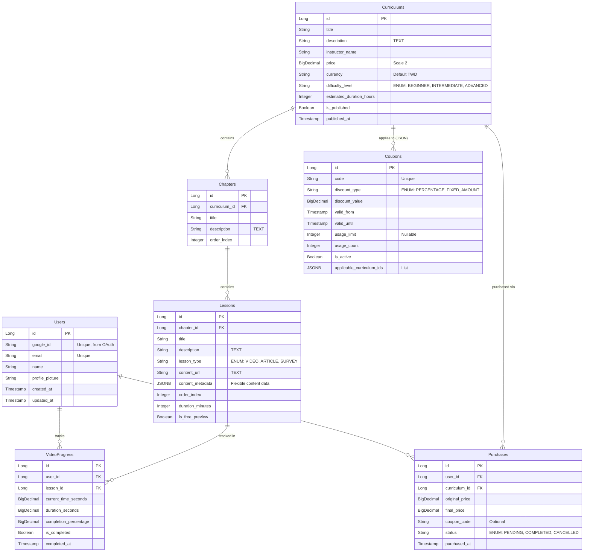

# WaterBallSA Database Schema Files

This directory contains the database schema definitions for the WaterBallSA online learning platform.

## 🗄️ Database Schema Reference

> **Note**: This schema reflects the actual Spring Boot JPA implementation. All Primary Keys are `Long` (Auto-Increment Identity), not UUIDs.

### Entity Relationship Diagram



---

### 📋 Table Definitions (PostgreSQL)

#### 1. Users
| Column | Type | Constraints | Description |
| :--- | :--- | :--- | :--- |
| `id` | BIGSERIAL | PK | Auto-increment ID |
| `google_id` | VARCHAR | UNIQUE, NOT NULL | OAuth Provider ID |
| `email` | VARCHAR | UNIQUE, NOT NULL | User Email |
| `name` | VARCHAR | NOT NULL | Display Name |
| `profile_picture` | VARCHAR | | Avatar URL |

#### 2. Curriculums
| Column | Type | Constraints | Description |
| :--- | :--- | :--- | :--- |
| `id` | BIGSERIAL | PK | |
| `title` | VARCHAR | NOT NULL | Course Title |
| `description` | TEXT | NOT NULL | Course Description |
| `instructor_name` | VARCHAR | NOT NULL | |
| `price` | NUMERIC(10,2) | NOT NULL | Base Price |
| `currency` | VARCHAR(3) | DEFAULT 'TWD' | ISO Currency Code |
| `difficulty_level` | VARCHAR | ENUM | BEGINNER, INTERMEDIATE, ADVANCED |
| `estimated_duration_hours` | INTEGER | NOT NULL | |
| `is_published` | BOOLEAN | DEFAULT false | |

#### 3. Chapters
| Column | Type | Constraints | Description |
| :--- | :--- | :--- | :--- |
| `id` | BIGSERIAL | PK | |
| `curriculum_id` | BIGINT | FK -> Curriculums | |
| `title` | VARCHAR | NOT NULL | |
| `description` | TEXT | | |
| `order_index` | INTEGER | NOT NULL | Ordering within curriculum |

#### 4. Lessons
| Column | Type | Constraints | Description |
| :--- | :--- | :--- | :--- |
| `id` | BIGSERIAL | PK | |
| `chapter_id` | BIGINT | FK -> Chapters | |
| `title` | VARCHAR | NOT NULL | |
| `lesson_type` | VARCHAR | ENUM | VIDEO, ARTICLE, SURVEY |
| `content_url` | TEXT | | Link to external resource (Video URL etc) |
| `content_metadata` | JSONB | | MySQL/Postgres JSON type |
| `is_free_preview` | BOOLEAN | DEFAULT false | |

#### 5. Video Progress
Unique Constraint: `(user_id, lesson_id)`
| Column | Type | Constraints | Description |
| :--- | :--- | :--- | :--- |
| `id` | BIGSERIAL | PK | |
| `user_id` | BIGINT | FK -> Users | |
| `lesson_id` | BIGINT | FK -> Lessons | |
| `current_time_seconds` | NUMERIC(10,2) | | Last watched position |
| `completion_percentage` | NUMERIC(5,2) | | 0-100% |
| `is_completed` | BOOLEAN | DEFAULT false | |

#### 6. Purchases
| Column | Type | Constraints | Description |
| :--- | :--- | :--- | :--- |
| `id` | BIGSERIAL | PK | |
| `user_id` | BIGINT | FK -> Users | |
| `curriculum_id` | BIGINT | FK -> Curriculums | |
| `original_price` | NUMERIC(10,2) | NOT NULL | Snapshot of price at purchase time |
| `final_price` | NUMERIC(10,2) | NOT NULL | Actual paid amount |
| `coupon_code` | VARCHAR(50) | | Applied coupon (optional) |
| `status` | VARCHAR | ENUM | PENDING, COMPLETED, CANCELLED |

#### 7. Coupons
| Column | Type | Constraints | Description |
| :--- | :--- | :--- | :--- |
| `id` | BIGSERIAL | PK | |
| `code` | VARCHAR(50) | UNIQUE, NOT NULL | Promo code |
| `discount_type` | VARCHAR | ENUM | PERCENTAGE, FIXED_AMOUNT |
| `discount_value` | NUMERIC(10,2) | NOT NULL | |
| `applicable_curriculum_ids` | JSONB | | List of IDs the coupon works for |
| `valid_from` | TIMESTAMP | NOT NULL | |
| `valid_until` | TIMESTAMP | NOT NULL | |
| `usage_limit` | INTEGER | | Max total uses globally |
| `usage_count` | INTEGER | DEFAULT 0 | Current usage |

---

## File Structure

```
backend/spec/data/
├── README.md                          # This file (Schema Reference)
├── entity_to_table_mapping.yml        # Entity to table name mapping
├── schema.sql                         # Complete database schema (All Phases)
└── validate_syntax.sh                 # Syntax validation script
```

## Development Phases

### Phase 1: Foundation Features
**Defined in:** `schema.sql`
Core learning platform features: Users, Curriculums, Chapters, Lessons, and Video Progress.

### Phase 2: Purchase System & Access Control
**Defined in:** `schema.sql`
Payment integration, Purchases history, and Coupons logic.

### Phase 3: Gamification & Assignments (Future)
**Defined in:** `schema.sql` (Conceptual/Planned)
Assignments, Submissions, Grading, and User Achievements.

## Usage

### Using Docker Compose
```bash
# Execute schema file inside the container
docker-compose exec postgres psql -U postgres -d waterballsa -f /docker-entrypoint-initdb.d/schema.sql
```

### Direct Connection
```bash
# Apply Complete Schema
psql -U postgres -d waterballsa -f schema.sql
```
