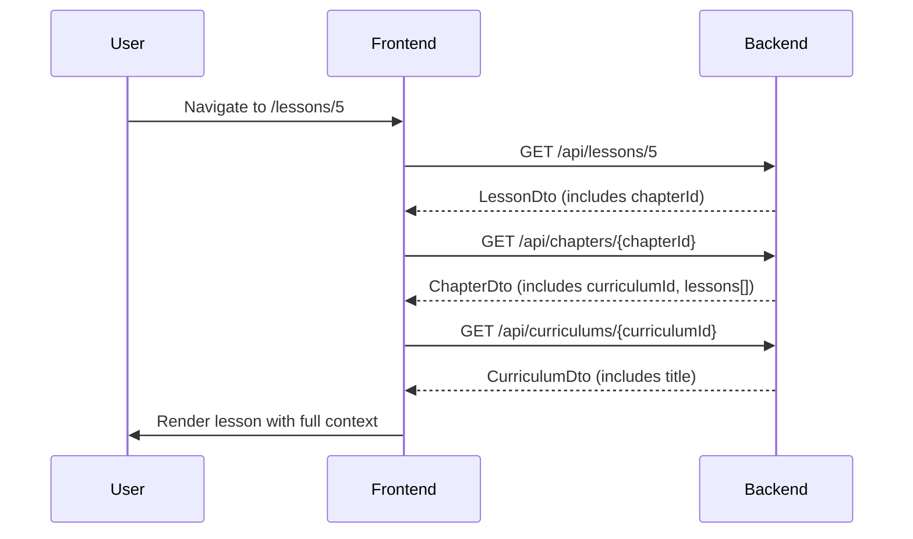

# Lesson Viewer API Contracts

> **Feature**: Lesson Viewer Frontend-Backend Integration
>
> **Status**: Specification Complete
>
> **Last Updated**: 2025-01-23

---

## Overview

This document defines the API contracts for the Lesson Viewer feature. The frontend will use these endpoints to fetch lesson content, navigation context, and metadata.

---

## Data Flow

### Complete Data Fetch Sequence

When a user navigates to `/lessons/{lessonId}`, the frontend performs the following API calls:



**Total API Calls**: 3 per lesson page load

**Alternative Optimization** (Future):
- Cache chapter and curriculum data from previous navigation
- Store in React Context or state management
- Reduce redundant fetches when navigating within the same chapter/curriculum

---

## API Endpoints

### 1. Get Lesson by ID

**Endpoint**: `GET /api/lessons/{id}`

**Purpose**: Fetch the primary lesson data including content URL, type, and metadata

**Path Parameters**:
- `id` (required, number): Lesson ID

**Response**: `200 OK`

```typescript
interface LessonDto {
  id: number
  chapterId: number  // Use this to fetch chapter data
  title: string
  description?: string
  lessonType: 'VIDEO' | 'ARTICLE' | 'SURVEY'
  contentUrl: string  // YouTube URL, article URL, or survey path
  orderIndex: number  // Position within chapter (0-based)
  durationMinutes?: number
  isFreePreview: boolean
  isPublished: boolean
  createdAt: string  // ISO 8601 format
  contentMetadata: Record<string, any>
}
```

**Example Request**:
```http
GET /api/lessons/5 HTTP/1.1
Host: localhost:8080
```

**Example Response** (VIDEO Lesson):
```json
{
  "id": 5,
  "chapterId": 1,
  "title": "Variables and Data Types",
  "description": "Understanding primitive types and variables",
  "lessonType": "VIDEO",
  "contentUrl": "https://www.youtube.com/watch?v=so1iUWaLmKA",
  "orderIndex": 4,
  "durationMinutes": 30,
  "isFreePreview": false,
  "isPublished": true,
  "createdAt": "2025-01-23T10:00:00Z",
  "contentMetadata": {
    "resolution": "1080p",
    "hasSubtitles": true
  }
}
```

**Example Response** (ARTICLE Lesson):
```json
{
  "id": 3,
  "chapterId": 1,
  "title": "Setting up IntelliJ IDEA",
  "description": "Configure your development environment",
  "lessonType": "ARTICLE",
  "contentUrl": "https://www.jetbrains.com/help/idea/getting-started.html",
  "orderIndex": 2,
  "durationMinutes": 15,
  "isFreePreview": false,
  "isPublished": true,
  "createdAt": "2025-01-23T10:00:00Z",
  "contentMetadata": {
    "wordCount": 1200,
    "readingLevel": "beginner"
  }
}
```

**Example Response** (SURVEY Lesson):
```json
{
  "id": 6,
  "chapterId": 1,
  "title": "Knowledge Check: Java Basics",
  "description": "Test your understanding of Java fundamentals",
  "lessonType": "SURVEY",
  "contentUrl": "/surveys/java-basics",
  "orderIndex": 5,
  "durationMinutes": 10,
  "isFreePreview": false,
  "isPublished": true,
  "createdAt": "2025-01-23T10:00:00Z",
  "contentMetadata": {
    "questionCount": 10,
    "passingScore": 70
  }
}
```

**Error Responses**:

`404 Not Found` - Lesson not found or not published:
```json
{
  "timestamp": "2025-01-23T10:00:00Z",
  "status": 404,
  "error": "Not Found",
  "message": "Lesson not found with id: 999",
  "path": "/api/lessons/999"
}
```

---

### 2. Get Chapter by ID (with Lessons)

**Endpoint**: `GET /api/chapters/{id}`

**Purpose**: Fetch chapter data including all lessons for navigation

**Path Parameters**:
- `id` (required, number): Chapter ID

**Response**: `200 OK`

```typescript
interface ChapterDto {
  id: number
  curriculumId: number  // Use this to fetch curriculum data
  title: string
  description?: string
  orderIndex: number
  isPublished: boolean
  estimatedDurationHours: number
  createdAt: string
  lessons: LessonDto[]  // All lessons in this chapter (ordered by orderIndex)
}
```

**Example Request**:
```http
GET /api/chapters/1 HTTP/1.1
Host: localhost:8080
```

**Example Response**:
```json
{
  "id": 1,
  "curriculumId": 1,
  "title": "Getting Started with Java",
  "description": "Introduction to Java programming language, setup, and first programs",
  "orderIndex": 0,
  "isPublished": true,
  "estimatedDurationHours": 5,
  "createdAt": "2025-01-23T10:00:00Z",
  "lessons": [
    {
      "id": 1,
      "chapterId": 1,
      "title": "Welcome to Java Programming",
      "lessonType": "VIDEO",
      "contentUrl": "https://www.youtube.com/watch?v=eIrMbAQSU34",
      "orderIndex": 0,
      "durationMinutes": 15,
      "isFreePreview": true,
      "isPublished": true,
      "createdAt": "2025-01-23T10:00:00Z",
      "contentMetadata": {
        "resolution": "1080p",
        "hasSubtitles": true
      }
    },
    {
      "id": 2,
      "chapterId": 1,
      "title": "Installing Java JDK",
      "lessonType": "VIDEO",
      "contentUrl": "https://www.youtube.com/watch?v=WRISYpKhIrc",
      "orderIndex": 1,
      "durationMinutes": 20,
      "isFreePreview": true,
      "isPublished": true,
      "createdAt": "2025-01-23T10:00:00Z",
      "contentMetadata": {
        "resolution": "1080p",
        "hasSubtitles": true
      }
    }
    // ... more lessons
  ]
}
```

**Usage in Frontend**:
```typescript
// Use lessons[] array to:
// 1. Find current lesson's position
// 2. Determine prev/next lesson IDs
// 3. Calculate progress (e.g., "Lesson 3 of 6")

const currentIndex = chapter.lessons.findIndex(l => l.id === currentLessonId)
const prevLesson = currentIndex > 0 ? chapter.lessons[currentIndex - 1] : null
const nextLesson = currentIndex < chapter.lessons.length - 1 ? chapter.lessons[currentIndex + 1] : null
const progress = `${currentIndex + 1} of ${chapter.lessons.length}`
```

**Error Responses**:

`404 Not Found` - Chapter not found or not published:
```json
{
  "timestamp": "2025-01-23T10:00:00Z",
  "status": 404,
  "error": "Not Found",
  "message": "Chapter not found with id: 999",
  "path": "/api/chapters/999"
}
```

---

### 3. Get Curriculum by ID

**Endpoint**: `GET /api/curriculums/{id}`

**Purpose**: Fetch curriculum data for breadcrumb display

**Path Parameters**:
- `id` (required, number): Curriculum ID

**Response**: `200 OK`

```typescript
interface CurriculumDto {
  id: number
  title: string
  description: string
  thumbnailUrl?: string
  instructorName: string
  price: number
  currency: string
  difficultyLevel: 'BEGINNER' | 'INTERMEDIATE' | 'ADVANCED'
  estimatedDurationHours: number
  isPublished: boolean
  publishedAt?: string
  createdAt: string
  chapters: ChapterDto[]  // Includes all chapters
}
```

**Example Request**:
```http
GET /api/curriculums/1 HTTP/1.1
Host: localhost:8080
```

**Example Response** (Partial):
```json
{
  "id": 1,
  "title": "Complete Java Programming Masterclass",
  "description": "Master Java programming from basics to advanced concepts...",
  "thumbnailUrl": "https://images.unsplash.com/photo-1517694712202-14dd9538aa97",
  "instructorName": "John Smith",
  "price": 99.99,
  "currency": "USD",
  "difficultyLevel": "BEGINNER",
  "estimatedDurationHours": 40,
  "isPublished": true,
  "publishedAt": "2025-01-01T00:00:00Z",
  "createdAt": "2025-01-01T00:00:00Z",
  "chapters": [
    // ... all chapters with lessons
  ]
}
```

**Usage in Frontend**:
```typescript
// We only need curriculum.title for the breadcrumb
// The full chapters[] array can be cached for future navigation
```

**Error Responses**:

`404 Not Found` - Curriculum not found or not published:
```json
{
  "timestamp": "2025-01-23T10:00:00Z",
  "status": 404,
  "error": "Not Found",
  "message": "Curriculum not found with id: 999",
  "path": "/api/curriculums/999"
}
```

---

## Content Metadata Schemas

### VIDEO Lessons

```typescript
interface VideoMetadata {
  resolution?: string  // e.g., "1080p", "720p"
  hasSubtitles?: boolean
  duration?: number  // Video duration in seconds (may differ from durationMinutes)
  language?: string  // e.g., "en", "zh"
}
```

**Example**:
```json
{
  "resolution": "1080p",
  "hasSubtitles": true
}
```

### ARTICLE Lessons

```typescript
interface ArticleMetadata {
  wordCount?: number
  readingLevel?: string  // e.g., "beginner", "intermediate", "advanced"
  codeExamples?: number  // Number of code snippets
  estimatedReadTime?: number  // Minutes (may differ from durationMinutes)
}
```

**Example**:
```json
{
  "wordCount": 1200,
  "readingLevel": "beginner",
  "codeExamples": 5
}
```

### SURVEY Lessons

```typescript
interface SurveyMetadata {
  questionCount?: number
  passingScore?: number  // Percentage (0-100)
  difficulty?: string  // e.g., "easy", "medium", "hard"
  timeLimit?: number  // Minutes (if timed)
}
```

**Example**:
```json
{
  "questionCount": 10,
  "passingScore": 70,
  "difficulty": "medium"
}
```

---

## Frontend API Client Implementation

### Recommended Approach

Create API client functions in `/frontend/src/lib/api/lessons.ts`:

```typescript
// Already exists
export const lessonsApi = {
  getById: async (id: number): Promise<Lesson> => {
    const response = await apiClient.get(`/lessons/${id}`)
    return response.data
  },

  getByChapterId: async (chapterId: number): Promise<Lesson[]> => {
    const response = await apiClient.get(`/lessons/chapter/${chapterId}`)
    return response.data
  },

  getFreePreview: async (curriculumId: number): Promise<Lesson[]> => {
    const response = await apiClient.get(`/lessons/curriculum/${curriculumId}/free-preview`)
    return response.data
  }
}
```

Update `/frontend/src/lib/api/chapters.ts`:

```typescript
// Add this if not exists
export const chaptersApi = {
  getById: async (id: number): Promise<Chapter> => {
    const response = await apiClient.get(`/chapters/${id}`)
    return response.data
  },

  getByCurriculumId: async (curriculumId: number): Promise<Chapter[]> => {
    const response = await apiClient.get(`/chapters/curriculum/${curriculumId}`)
    return response.data
  }
}
```

---

## Page Load Data Fetching Strategy

### Option 1: Sequential Fetching (Recommended for Phase 1)

```typescript
// /frontend/src/app/lessons/[id]/page.tsx

export default async function LessonPage({ params }: { params: { id: string } }) {
  const lessonId = parseInt(params.id)

  // Step 1: Fetch lesson
  const lesson = await lessonsApi.getById(lessonId)

  // Step 2: Fetch chapter (includes all lessons for nav)
  const chapter = await chaptersApi.getById(lesson.chapterId)

  // Step 3: Fetch curriculum (for breadcrumb)
  const curriculum = await curriculumsApi.getById(chapter.curriculumId)

  return (
    <LessonViewer
      lesson={lesson}
      chapter={chapter}
      curriculum={curriculum}
    />
  )
}
```

**Pros**:
- Simple and straightforward
- Clear data dependencies
- Easy to debug

**Cons**:
- 3 sequential HTTP requests (slower)
- Total load time = sum of all request times

### Option 2: Parallel Fetching (Future Optimization)

```typescript
export default async function LessonPage({ params }: { params: { id: string } }) {
  const lessonId = parseInt(params.id)

  // Fetch lesson first to get chapterId
  const lesson = await lessonsApi.getById(lessonId)

  // Then fetch chapter and curriculum in parallel
  const [chapter, curriculum] = await Promise.all([
    chaptersApi.getById(lesson.chapterId),
    // Assuming we can derive curriculumId from chapterId
    // Or we could add curriculumId to LessonDto
  ])

  return (
    <LessonViewer
      lesson={lesson}
      chapter={chapter}
      curriculum={curriculum}
    />
  )
}
```

### Option 3: Client-Side Fetching with Loading States

```typescript
'use client'

export default function LessonPage({ params }: { params: { id: string } }) {
  const [data, setData] = useState<{
    lesson?: Lesson
    chapter?: Chapter
    curriculum?: Curriculum
  }>({})
  const [loading, setLoading] = useState(true)
  const [error, setError] = useState<string | null>(null)

  useEffect(() => {
    async function fetchData() {
      try {
        const lesson = await lessonsApi.getById(parseInt(params.id))
        const chapter = await chaptersApi.getById(lesson.chapterId)
        const curriculum = await curriculumsApi.getById(chapter.curriculumId)

        setData({ lesson, chapter, curriculum })
      } catch (err) {
        setError('Failed to load lesson')
      } finally {
        setLoading(false)
      }
    }

    fetchData()
  }, [params.id])

  if (loading) return <LessonSkeleton />
  if (error) return <ErrorPage message={error} />

  return <LessonViewer {...data} />
}
```

---

## Error Handling

### Common Error Scenarios

1. **Lesson Not Found (404)**:
   - Display: "Lesson not found"
   - Action: Provide link to browse curriculums

2. **Lesson Not Published (404)**:
   - Display: "This lesson is not available"
   - Action: Redirect to curriculum page

3. **Network Error**:
   - Display: "Failed to load lesson. Please try again."
   - Action: Provide retry button

4. **Invalid Lesson ID**:
   - Display: "Invalid lesson ID"
   - Action: Redirect to home page

### Frontend Error Handling Template

```typescript
try {
  const lesson = await lessonsApi.getById(lessonId)
  // ... continue with fetching
} catch (error: any) {
  if (error.response?.status === 404) {
    // Show 404 page
    return <NotFound message="Lesson not found" />
  } else if (error.response?.status >= 500) {
    // Server error
    return <ErrorPage message="Server error. Please try again later." />
  } else {
    // Network or other error
    return <ErrorPage message="Failed to load lesson. Please check your connection." />
  }
}
```

---

## Performance Considerations

### Caching Strategy

**Phase 1**: No caching (simple implementation)

**Future Enhancements**:
1. Cache chapter and curriculum data in React Context
2. Use SWR or React Query for automatic caching and revalidation
3. Implement service worker for offline support
4. Pre-fetch next lesson when current lesson is being viewed

### Bundle Size

Adding `react-player` will increase bundle size by ~200KB (gzipped: ~50KB).

**Mitigation**:
- Use dynamic imports for video player:
  ```typescript
  const VideoPlayer = dynamic(() => import('@/components/VideoPlayer'), {
    loading: () => <VideoPlayerSkeleton />,
    ssr: false
  })
  ```

---

## Testing API Contracts

### Manual Testing with cURL

```bash
# Test lesson endpoint
curl http://localhost:8080/api/lessons/1

# Test chapter endpoint
curl http://localhost:8080/api/chapters/1

# Test curriculum endpoint
curl http://localhost:8080/api/curriculums/1
```

### Integration Tests

Create tests in `/frontend/src/lib/api/__tests__/lessons.test.ts`:

```typescript
describe('Lessons API', () => {
  it('should fetch lesson by ID', async () => {
    const lesson = await lessonsApi.getById(1)
    expect(lesson).toHaveProperty('id', 1)
    expect(lesson).toHaveProperty('lessonType')
    expect(lesson).toHaveProperty('contentUrl')
  })

  it('should throw error for non-existent lesson', async () => {
    await expect(lessonsApi.getById(999999)).rejects.toThrow()
  })
})
```

---

## API Versioning

**Current Version**: v1 (implicit in `/api/` prefix)

**Future Considerations**:
- If breaking changes are needed, use `/api/v2/` prefix
- Maintain backward compatibility for at least 6 months
- Document migration path in API changelog

---

## References

- [Backend API Controllers](../../backend/src/main/java/com/waterballsa/backend/controller/)
- [DTO Definitions](../../backend/src/main/java/com/waterballsa/backend/dto/)
- [Swagger UI](http://localhost:8080/swagger-ui.html) (when backend is running)
- [Lesson Viewer Specification](../specifications/lesson-viewer.md)
